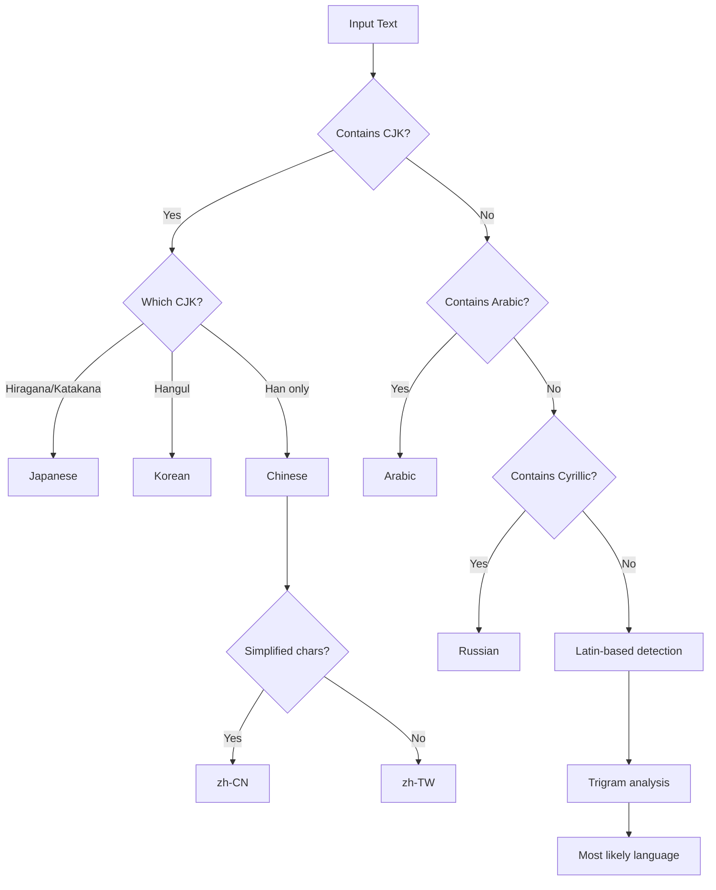
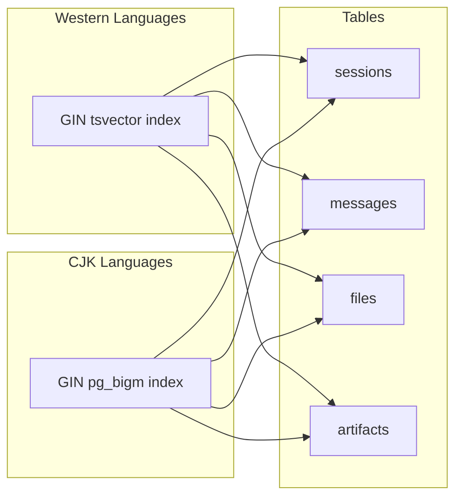

# Multi-Language Search API Reference

> **Version**: 5.52.29 | **Last Updated**: January 25, 2026 | **Base URL**: `https://api.radiant.ai/v1`

Complete API reference for RADIANT's multi-language full-text search capabilities, including CJK (Chinese, Japanese, Korean) bi-gram search.

---

## Table of Contents

1. [Overview](#overview)
2. [Search Endpoints](#search-endpoints)
3. [Language Detection](#language-detection)
4. [Search Methods](#search-methods)
5. [Filtering and Pagination](#filtering-and-pagination)
6. [Response Format](#response-format)
7. [Error Handling](#error-handling)

---

## Overview

RADIANT provides intelligent multi-language search across all content types, with automatic language detection and optimized search strategies for different language families.

### Supported Languages

| Language | Code | Search Method | Features |
|----------|------|---------------|----------|
| English | `en` | PostgreSQL FTS | Stemming, ranking |
| Spanish | `es` | PostgreSQL FTS | Stemming, ranking |
| French | `fr` | PostgreSQL FTS | Stemming, ranking |
| German | `de` | PostgreSQL FTS | Compound word handling |
| Portuguese | `pt` | PostgreSQL FTS | Stemming, ranking |
| Italian | `it` | PostgreSQL FTS | Stemming, ranking |
| Dutch | `nl` | PostgreSQL FTS | Stemming, ranking |
| Polish | `pl` | Simple FTS | Basic tokenization |
| Russian | `ru` | PostgreSQL FTS | Stemming, ranking |
| Turkish | `tr` | PostgreSQL FTS | Stemming, ranking |
| **Japanese** | `ja` | **pg_bigm** | Bi-gram indexing |
| **Korean** | `ko` | **pg_bigm** | Bi-gram indexing |
| **Chinese (Simplified)** | `zh-CN` | **pg_bigm** | Bi-gram indexing |
| **Chinese (Traditional)** | `zh-TW` | **pg_bigm** | Bi-gram indexing |
| Arabic | `ar` | Simple FTS | Basic tokenization |
| Hindi | `hi` | Simple FTS | Basic tokenization |
| Thai | `th` | Simple FTS | Basic tokenization |
| Vietnamese | `vi` | Simple FTS | Basic tokenization |

### Authentication

All search endpoints require authentication:

```http
Authorization: Bearer <access_token>
```

---

## Search Endpoints

### Universal Search

Search across all content types.

```http
POST /search
Authorization: Bearer <access_token>
Content-Type: application/json
```

**Request Body:**

```json
{
  "query": "machine learning",
  "types": ["sessions", "messages", "files", "artifacts"],
  "limit": 20,
  "offset": 0,
  "filters": {
    "created_after": "2025-01-01T00:00:00Z",
    "created_before": "2026-01-25T23:59:59Z"
  },
  "language_hint": null
}
```

**Parameters:**

| Parameter | Type | Required | Description |
|-----------|------|----------|-------------|
| `query` | string | Yes | Search query (1-500 characters) |
| `types` | string[] | No | Content types to search (default: all) |
| `limit` | integer | No | Results per page (1-100, default: 20) |
| `offset` | integer | No | Pagination offset (default: 0) |
| `filters` | object | No | Additional filters |
| `language_hint` | string | No | Override language detection |

**Response 200:**

```json
{
  "results": [
    {
      "id": "sess_abc123",
      "type": "session",
      "title": "Machine Learning Project Discussion",
      "snippet": "...exploring various <mark>machine learning</mark> algorithms for...",
      "relevance_score": 0.95,
      "created_at": "2026-01-20T10:30:00Z",
      "updated_at": "2026-01-24T15:00:00Z"
    },
    {
      "id": "msg_def456",
      "type": "message",
      "session_id": "sess_xyz789",
      "snippet": "...the <mark>machine learning</mark> model achieved 95% accuracy...",
      "relevance_score": 0.87,
      "created_at": "2026-01-22T14:00:00Z"
    }
  ],
  "total": 42,
  "limit": 20,
  "offset": 0,
  "detected_language": "en",
  "search_method": "fts",
  "query_time_ms": 45
}
```

### Search Sessions

Search within Think Tank sessions.

```http
POST /search/sessions
Authorization: Bearer <access_token>
Content-Type: application/json
```

**Request Body:**

```json
{
  "query": "プロジェクト計画",
  "limit": 20,
  "filters": {
    "workspace_id": "ws_abc123",
    "created_after": "2025-01-01T00:00:00Z"
  }
}
```

**Response 200:**

```json
{
  "results": [
    {
      "id": "sess_abc123",
      "title": "プロジェクト計画ミーティング",
      "snippet": "...新しい<mark>プロジェクト計画</mark>について議論しました...",
      "message_count": 45,
      "relevance_score": 0.92,
      "created_at": "2026-01-15T09:00:00Z",
      "last_message_at": "2026-01-24T18:30:00Z"
    }
  ],
  "total": 8,
  "detected_language": "ja",
  "search_method": "pg_bigm"
}
```

### Search Messages

Search within session messages.

```http
POST /search/messages
Authorization: Bearer <access_token>
Content-Type: application/json
```

**Request Body:**

```json
{
  "query": "API integration",
  "session_id": "sess_abc123",
  "limit": 50
}
```

**Response 200:**

```json
{
  "results": [
    {
      "id": "msg_def456",
      "session_id": "sess_abc123",
      "role": "assistant",
      "snippet": "...the <mark>API integration</mark> requires the following steps...",
      "relevance_score": 0.89,
      "created_at": "2026-01-20T11:30:00Z"
    }
  ],
  "total": 15,
  "detected_language": "en",
  "search_method": "fts"
}
```

### Search Files

Search within uploaded files and documents.

```http
POST /search/files
Authorization: Bearer <access_token>
Content-Type: application/json
```

**Request Body:**

```json
{
  "query": "quarterly report",
  "file_types": ["pdf", "docx"],
  "limit": 20
}
```

**Response 200:**

```json
{
  "results": [
    {
      "id": "file_abc123",
      "name": "Q4-2025-Report.pdf",
      "snippet": "...the <mark>quarterly report</mark> shows significant growth...",
      "file_type": "pdf",
      "size_bytes": 2456789,
      "relevance_score": 0.94,
      "uploaded_at": "2026-01-10T08:00:00Z"
    }
  ],
  "total": 5,
  "detected_language": "en",
  "search_method": "fts"
}
```

### Search Artifacts

Search within generated artifacts (code, documents, etc.).

```http
POST /search/artifacts
Authorization: Bearer <access_token>
Content-Type: application/json
```

**Request Body:**

```json
{
  "query": "React component",
  "artifact_types": ["code", "document"],
  "limit": 20
}
```

**Response 200:**

```json
{
  "results": [
    {
      "id": "art_xyz789",
      "title": "UserProfile React Component",
      "type": "code",
      "language": "typescript",
      "snippet": "...export const UserProfile: <mark>React</mark>.<mark>Component</mark>...",
      "relevance_score": 0.91,
      "session_id": "sess_abc123",
      "created_at": "2026-01-18T14:00:00Z"
    }
  ],
  "total": 12,
  "detected_language": "en",
  "search_method": "fts"
}
```

---

## Language Detection

### Detect Language

Detect the primary language of text.

```http
POST /search/detect-language
Authorization: Bearer <access_token>
Content-Type: application/json
```

**Request Body:**

```json
{
  "text": "这是一个测试文本，用于检测语言"
}
```

**Response 200:**

```json
{
  "detected_language": "zh-CN",
  "confidence": 0.98,
  "script": "han",
  "search_method": "pg_bigm",
  "alternatives": [
    { "language": "zh-TW", "confidence": 0.85 },
    { "language": "ja", "confidence": 0.12 }
  ]
}
```

### Detection Algorithm



---

## Search Methods

### PostgreSQL Full-Text Search (FTS)

Used for Western languages with word boundaries.

**Features:**
- Stemming (running → run)
- Stop word removal
- Relevance ranking (ts_rank)
- Phrase search (`"exact phrase"`)
- Prefix matching (`machine*`)

**Example Query Processing:**

```
Input: "machine learning algorithms"
↓
Stemmed: machine learn algorithm
↓
tsvector: 'algorithm':3 'learn':2 'machin':1
```

### pg_bigm Bi-gram Search

Used for CJK languages without word boundaries.

**Features:**
- Character bi-gram indexing
- Substring matching
- No dictionary required
- Fuzzy matching support

**Example Query Processing (Japanese):**

```
Input: "人工知能"
↓
Bi-grams: "人工", "工知", "知能"
↓
Search: LIKE '%人工%' AND LIKE '%工知%' AND LIKE '%知能%'
(optimized via GIN index)
```

### Simple Search

Used for languages without dedicated FTS support.

**Features:**
- Basic word tokenization
- No stemming
- Case-insensitive matching

---

## Filtering and Pagination

### Available Filters

| Filter | Type | Description |
|--------|------|-------------|
| `created_after` | ISO 8601 | Results created after this date |
| `created_before` | ISO 8601 | Results created before this date |
| `workspace_id` | string | Filter by workspace |
| `session_id` | string | Filter by session |
| `file_types` | string[] | Filter by file extensions |
| `artifact_types` | string[] | Filter by artifact type |

### Pagination

```json
{
  "query": "search term",
  "limit": 20,
  "offset": 40
}
```

| Parameter | Default | Maximum |
|-----------|---------|---------|
| `limit` | 20 | 100 |
| `offset` | 0 | 10000 |

### Cursor-Based Pagination (Recommended)

For large result sets, use cursor pagination:

```http
POST /search
Content-Type: application/json
```

**First Request:**

```json
{
  "query": "data analysis",
  "limit": 20
}
```

**Response:**

```json
{
  "results": [...],
  "total": 500,
  "next_cursor": "eyJvZmZzZXQiOjIwfQ==",
  "has_more": true
}
```

**Next Request:**

```json
{
  "query": "data analysis",
  "limit": 20,
  "cursor": "eyJvZmZzZXQiOjIwfQ=="
}
```

---

## Response Format

### Result Object

```json
{
  "id": "string",
  "type": "session | message | file | artifact",
  "title": "string (if applicable)",
  "snippet": "string with <mark>highlighted</mark> matches",
  "relevance_score": 0.0-1.0,
  "created_at": "ISO 8601",
  "updated_at": "ISO 8601 (if applicable)",
  "metadata": {}
}
```

### Snippet Highlighting

Matched terms are wrapped in `<mark>` tags:

```json
{
  "snippet": "The <mark>machine learning</mark> model uses <mark>neural networks</mark>..."
}
```

Configure highlighting:

```json
{
  "query": "machine learning",
  "highlight": {
    "pre_tag": "<em class='highlight'>",
    "post_tag": "</em>",
    "max_length": 200
  }
}
```

### Metadata by Type

**Session:**
```json
{
  "message_count": 45,
  "participant_count": 1,
  "workspace_id": "ws_abc123"
}
```

**Message:**
```json
{
  "session_id": "sess_abc123",
  "role": "user | assistant",
  "message_index": 15
}
```

**File:**
```json
{
  "file_type": "pdf",
  "size_bytes": 2456789,
  "page_count": 25
}
```

**Artifact:**
```json
{
  "artifact_type": "code | document | image",
  "language": "typescript",
  "session_id": "sess_abc123"
}
```

---

## Error Handling

### Error Response Format

```json
{
  "error": "error_code",
  "message": "Human-readable description",
  "details": {},
  "request_id": "req_abc123"
}
```

### Error Codes

| Code | HTTP Status | Description |
|------|-------------|-------------|
| `invalid_query` | 400 | Query is empty or too long |
| `invalid_filter` | 400 | Invalid filter parameter |
| `invalid_language` | 400 | Unknown language code |
| `unauthorized` | 401 | Missing or invalid token |
| `forbidden` | 403 | No access to resource |
| `rate_limited` | 429 | Too many requests |
| `search_timeout` | 504 | Search took too long |
| `internal_error` | 500 | Server error |

### Rate Limits

| Endpoint | Limit | Window |
|----------|-------|--------|
| `/search` | 60 requests | 1 minute |
| `/search/*` | 100 requests | 1 minute |
| `/search/detect-language` | 120 requests | 1 minute |

---

## Examples

### CJK Search Example (Japanese)

```http
POST /search/sessions
Authorization: Bearer <access_token>
Content-Type: application/json

{
  "query": "人工知能の研究",
  "limit": 10
}
```

**Response:**

```json
{
  "results": [
    {
      "id": "sess_jp001",
      "title": "人工知能プロジェクト",
      "snippet": "...<mark>人工知能</mark>の<mark>研究</mark>における最新の進展...",
      "relevance_score": 0.94
    }
  ],
  "detected_language": "ja",
  "search_method": "pg_bigm",
  "query_time_ms": 32
}
```

### Mixed Language Search

```http
POST /search
Authorization: Bearer <access_token>
Content-Type: application/json

{
  "query": "AI 인공지능 development",
  "limit": 20
}
```

**Response:**

```json
{
  "results": [...],
  "detected_language": "ko",
  "search_method": "pg_bigm",
  "note": "Mixed-language query detected. CJK method used for best coverage."
}
```

### Advanced Filtering

```http
POST /search
Authorization: Bearer <access_token>
Content-Type: application/json

{
  "query": "project planning",
  "types": ["sessions", "artifacts"],
  "filters": {
    "workspace_id": "ws_main",
    "created_after": "2026-01-01T00:00:00Z",
    "artifact_types": ["document"]
  },
  "limit": 50
}
```

---

## Performance Considerations

### Query Optimization Tips

| Tip | Reason |
|-----|--------|
| Use specific queries | Reduces result set size |
| Filter by type when possible | Limits tables to search |
| Use date filters | Indexes are date-partitioned |
| Avoid leading wildcards | Cannot use index efficiently |

### Index Architecture



---

## Related Documentation

- [Internationalization Guide](../authentication/i18n-guide.md)
- [Authentication API](./authentication-api.md)
- [Section 41: Internationalization](../sections/SECTION-41-INTERNATIONALIZATION.md)
