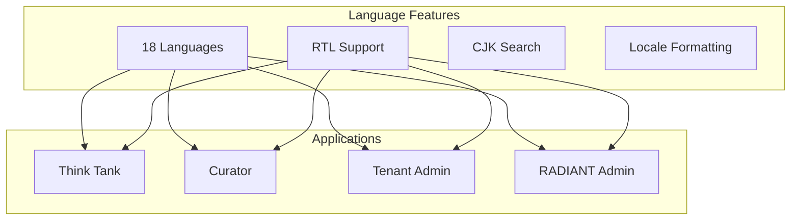
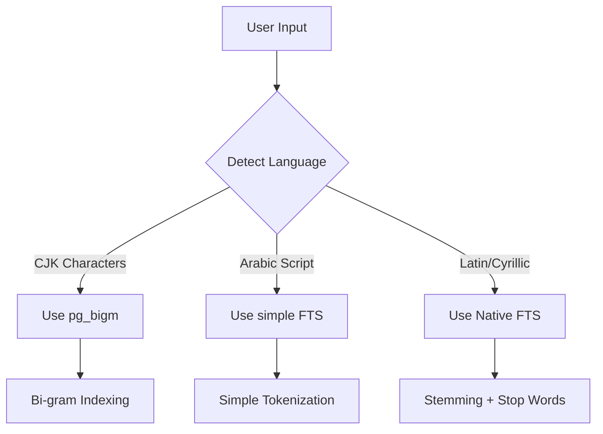
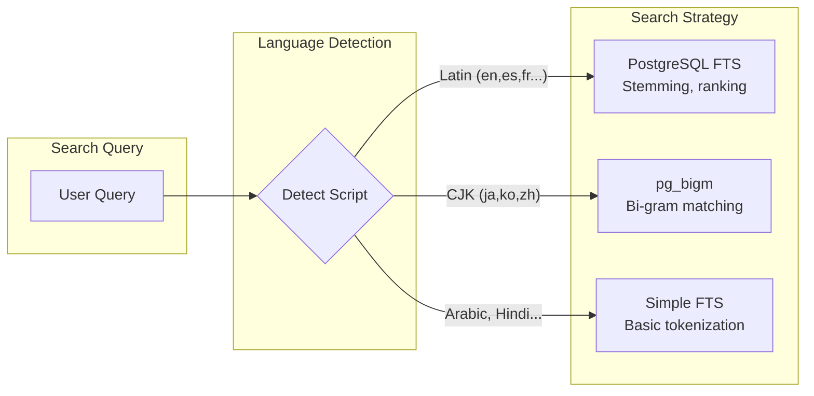

# Internationalization (i18n) Guide

> **Version**: 5.52.29 | **Last Updated**: January 25, 2026 | **Audience**: All Users & Developers

This guide covers RADIANT's internationalization features, including 18 supported languages, RTL support for Arabic, and multi-language search with CJK (Chinese, Japanese, Korean) support.

---

## Table of Contents

1. [Overview](#overview)
2. [Supported Languages](#supported-languages)
3. [Changing Your Language](#changing-your-language)
4. [Right-to-Left (RTL) Support](#right-to-left-rtl-support)
5. [Multi-Language Search](#multi-language-search)
6. [For Developers](#for-developers)
7. [For Administrators](#for-administrators)

---

## Overview

RADIANT supports 18 languages across all applications, with special handling for:

- **Right-to-Left (RTL)** languages like Arabic
- **CJK (Chinese, Japanese, Korean)** languages with bi-gram search
- **Locale-specific** date, time, and number formatting



---

## Supported Languages

RADIANT supports 18 languages with varying levels of full-text search support:

| Language | Code | Native Name | Direction | Search Method |
|----------|------|-------------|-----------|---------------|
| English | `en` | English | LTR | PostgreSQL FTS |
| Spanish | `es` | Español | LTR | PostgreSQL FTS |
| French | `fr` | Français | LTR | PostgreSQL FTS |
| German | `de` | Deutsch | LTR | PostgreSQL FTS |
| Portuguese | `pt` | Português | LTR | PostgreSQL FTS |
| Italian | `it` | Italiano | LTR | PostgreSQL FTS |
| Dutch | `nl` | Nederlands | LTR | PostgreSQL FTS |
| Polish | `pl` | Polski | LTR | PostgreSQL `simple` |
| Russian | `ru` | Русский | LTR | PostgreSQL FTS |
| Turkish | `tr` | Türkçe | LTR | PostgreSQL FTS |
| Japanese | `ja` | 日本語 | LTR | `pg_bigm` bi-gram |
| Korean | `ko` | 한국어 | LTR | `pg_bigm` bi-gram |
| Chinese (Simplified) | `zh-CN` | 简体中文 | LTR | `pg_bigm` bi-gram |
| Chinese (Traditional) | `zh-TW` | 繁體中文 | LTR | `pg_bigm` bi-gram |
| **Arabic** | `ar` | العربية | **RTL** | PostgreSQL `simple` |
| Hindi | `hi` | हिन्दी | LTR | PostgreSQL `simple` |
| Thai | `th` | ไทย | LTR | PostgreSQL `simple` |
| Vietnamese | `vi` | Tiếng Việt | LTR | PostgreSQL `simple` |

### Language Detection

RADIANT automatically detects the primary language of your content for optimal search indexing:



---

## Changing Your Language

### In Think Tank / Curator

1. Click your **avatar** in the top-right corner
2. Select **Settings**
3. Click **Language & Region**
4. Select your preferred **language** from the dropdown
5. The interface updates immediately

### In Tenant Admin / RADIANT Admin

1. Click your **avatar** in the top-right corner
2. Select **Account Settings**
3. Navigate to **Preferences** → **Language**
4. Select your language
5. Click **Save**

### During Sign-In

The sign-in page automatically detects your browser language. To change it:

1. Look for the **language selector** (usually bottom of the page)
2. Click and select your language
3. The sign-in page reloads in your language

---

## Right-to-Left (RTL) Support

When using Arabic, the entire interface automatically adapts:

### What Changes

| Element | RTL Behavior |
|---------|--------------|
| **Text direction** | Flows right-to-left |
| **Navigation** | Moves to the right side |
| **Icons** | Directional icons are mirrored |
| **Buttons** | Order is reversed |
| **Forms** | Labels and inputs are flipped |
| **Tables** | Columns flow right-to-left |

### What Stays Left-to-Right

Certain elements remain LTR for clarity:

| Element | Reason |
|---------|--------|
| **Email addresses** | Standard format worldwide |
| **URLs** | Technical format |
| **Code blocks** | Programming languages are LTR |
| **Passwords** | Consistency and security |
| **Phone numbers** | International format |
| **MFA codes** | Numeric sequences |

### Visual Example

```
┌─────────────────────────────────────────────────────┐
│ LTR Layout (English)                                │
├─────────────────────────────────────────────────────┤
│ [Logo] Navigation ────────────────────  [Avatar ▼] │
│                                                     │
│ [Sidebar]  │  Main Content Area                    │
│            │                                        │
│            │  Form Label: [Input Field        ]    │
│            │  [Cancel]              [Submit ➔]     │
│                                                     │
└─────────────────────────────────────────────────────┘

┌─────────────────────────────────────────────────────┐
│ RTL Layout (Arabic)                                 │
├─────────────────────────────────────────────────────┤
│ [▼ الملف] ────────────────────  التنقل [الشعار]   │
│                                                     │
│                    │  [الشريط الجانبي]              │
│  منطقة المحتوى الرئيسية                            │
│                                                     │
│ [        حقل الإدخال] :تسمية النموذج               │
│ [←إرسال]              [إلغاء]                      │
│                                                     │
└─────────────────────────────────────────────────────┘
```

---

## Multi-Language Search

RADIANT provides intelligent search across all supported languages.

### How It Works



### CJK Search (Chinese, Japanese, Korean)

CJK languages don't have word boundaries, so traditional full-text search doesn't work. RADIANT uses **bi-gram indexing** (`pg_bigm`):

| Feature | Description |
|---------|-------------|
| **No word segmentation needed** | Works without dictionaries |
| **Substring matching** | Find partial words/phrases |
| **Mixed-language support** | Search CJK + English together |
| **Fuzzy matching** | Find similar terms |

**Example:**

Searching for `人工知能` (artificial intelligence) finds:
- Exact matches: `人工知能`
- Partial matches: `人工知能技術` (AI technology)
- Mixed: `AIと人工知能の違い` (Difference between AI and artificial intelligence)

### Western Language Search

For Latin-script and Cyrillic languages, RADIANT uses PostgreSQL's native full-text search:

| Feature | Description |
|---------|-------------|
| **Stemming** | "running" matches "run", "runs" |
| **Stop words** | Common words ("the", "is") are ignored |
| **Ranking** | Results sorted by relevance |
| **Phrase search** | `"exact phrase"` matching |

### Search Tips by Language

| Language | Tip |
|----------|-----|
| **English** | Use quotes for exact phrases: `"machine learning"` |
| **Spanish** | Accents are normalized: `café` = `cafe` |
| **German** | Compound words are split: `Softwareentwicklung` |
| **Japanese** | Hiragana, katakana, and kanji all work |
| **Chinese** | Both simplified and traditional are indexed |
| **Korean** | Hangul syllables are bi-gram indexed |
| **Arabic** | Diacritics are normalized |

---

## For Developers

### Using Translations in Code

**React (Admin Dashboard):**

```typescript
import { useTranslation } from '@/hooks/useTranslation';

function MyComponent() {
  const { t, language, setLanguage, isRTL } = useTranslation();
  
  return (
    <div dir={isRTL ? 'rtl' : 'ltr'}>
      <h1>{t('auth.login.title')}</h1>
      <p>{t('auth.login.description')}</p>
      <button>{t('common.submit')}</button>
    </div>
  );
}
```

**Translation Files Structure:**

```
locales/
├── auth/
│   ├── en.json
│   ├── es.json
│   ├── fr.json
│   ├── ja.json
│   ├── ko.json
│   ├── zh-CN.json
│   ├── ar.json
│   └── ...
└── index.ts
```

**Example Translation File (`en.json`):**

```json
{
  "auth": {
    "login": {
      "title": "Sign In",
      "description": "Welcome back! Please sign in to continue.",
      "email_placeholder": "Enter your email",
      "password_placeholder": "Enter your password",
      "submit": "Sign In",
      "forgot_password": "Forgot password?",
      "no_account": "Don't have an account?",
      "sign_up": "Sign up"
    },
    "mfa": {
      "title": "Two-Factor Authentication",
      "enter_code": "Enter the 6-digit code from your authenticator app",
      "verify": "Verify",
      "use_backup": "Use a backup code"
    }
  },
  "common": {
    "submit": "Submit",
    "cancel": "Cancel",
    "save": "Save",
    "delete": "Delete",
    "loading": "Loading...",
    "error": "An error occurred"
  }
}
```

### RTL CSS Utilities

**RTL-aware CSS classes (`rtl.css`):**

```css
/* Automatic margin/padding flipping */
[dir="rtl"] .ml-4 { margin-left: 0; margin-right: 1rem; }
[dir="rtl"] .mr-4 { margin-right: 0; margin-left: 1rem; }
[dir="rtl"] .pl-4 { padding-left: 0; padding-right: 1rem; }
[dir="rtl"] .pr-4 { padding-right: 0; padding-left: 1rem; }

/* Text alignment flipping */
[dir="rtl"] .text-left { text-align: right; }
[dir="rtl"] .text-right { text-align: left; }

/* Flex direction flipping */
[dir="rtl"] .flex-row { flex-direction: row-reverse; }

/* Preserve LTR for specific content */
.ltr-preserve {
  direction: ltr !important;
  unicode-bidi: embed;
}

/* Apply to emails, codes, passwords */
input[type="email"],
input[type="password"],
.code-input,
.mfa-code {
  direction: ltr;
  text-align: left;
}
```

### useRTL Hook

```typescript
import { useRTL } from '@/hooks/useRTL';

function MyComponent() {
  const { isRTL, dir, flipMargin, flipPadding, flipTextAlign } = useRTL();
  
  return (
    <div 
      dir={dir}
      className={`${flipMargin('ml-4')} ${flipTextAlign('text-left')}`}
    >
      {/* Content */}
    </div>
  );
}
```

### Multi-Language Search API

```typescript
// Search with automatic language detection
const results = await searchService.search({
  query: '人工知能', // Japanese
  tenantId: 'tenant_123',
  // Language is auto-detected, but can be overridden:
  // languageHint: 'ja'
});

// Results include detected language
console.log(results.detectedLanguage); // 'ja'
console.log(results.searchMethod); // 'pg_bigm'
```

---

## For Administrators

### Setting Default Language

**Tenant Admins:**

1. Navigate to **Admin** → **Settings** → **Localization**
2. Set **Default Language** for new users
3. Set **Fallback Language** (used when translation is missing)
4. Click **Save**

**Platform Admins:**

1. Navigate to **Platform Admin** → **Configuration** → **Localization**
2. Set platform-wide defaults
3. Enable/disable languages per tenant tier

### Translation Management

**Viewing Translation Coverage:**

1. Navigate to **Admin** → **Settings** → **Localization** → **Coverage**
2. View translation status by language:
   - ✅ **100%** - Fully translated
   - 🟡 **90%+** - Nearly complete
   - 🔴 **<90%** - Missing translations

### Custom Translations

Tenants can override default translations:

1. Navigate to **Admin** → **Settings** → **Localization** → **Custom**
2. Select a language
3. Search for the key to override
4. Enter your custom translation
5. Click **Save**

Custom translations take precedence over defaults.

### Search Configuration

**Enabling CJK Search:**

CJK search requires the `pg_bigm` PostgreSQL extension. This is automatically configured for all tenants.

**Search Indexing:**

Content is automatically indexed in the detected language. To re-index:

1. Navigate to **Admin** → **Settings** → **Search**
2. Click **Rebuild Index**
3. Wait for indexing to complete (can take several minutes)

---

## Related Documentation

- [Authentication Overview](./overview.md)
- [User Guide](./user-guide.md)
- [Search API Reference](../api/search-api.md)
- [Section 41: Internationalization](../sections/SECTION-41-INTERNATIONALIZATION.md)
