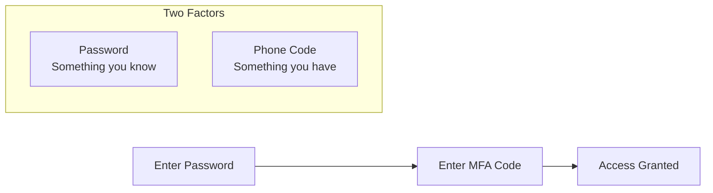
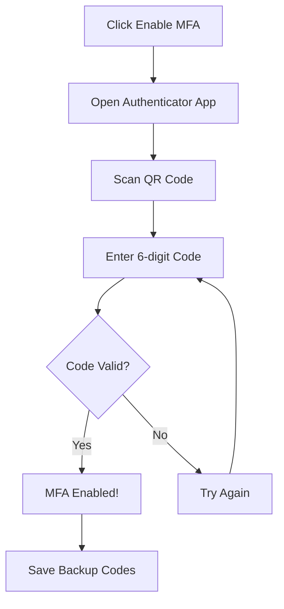
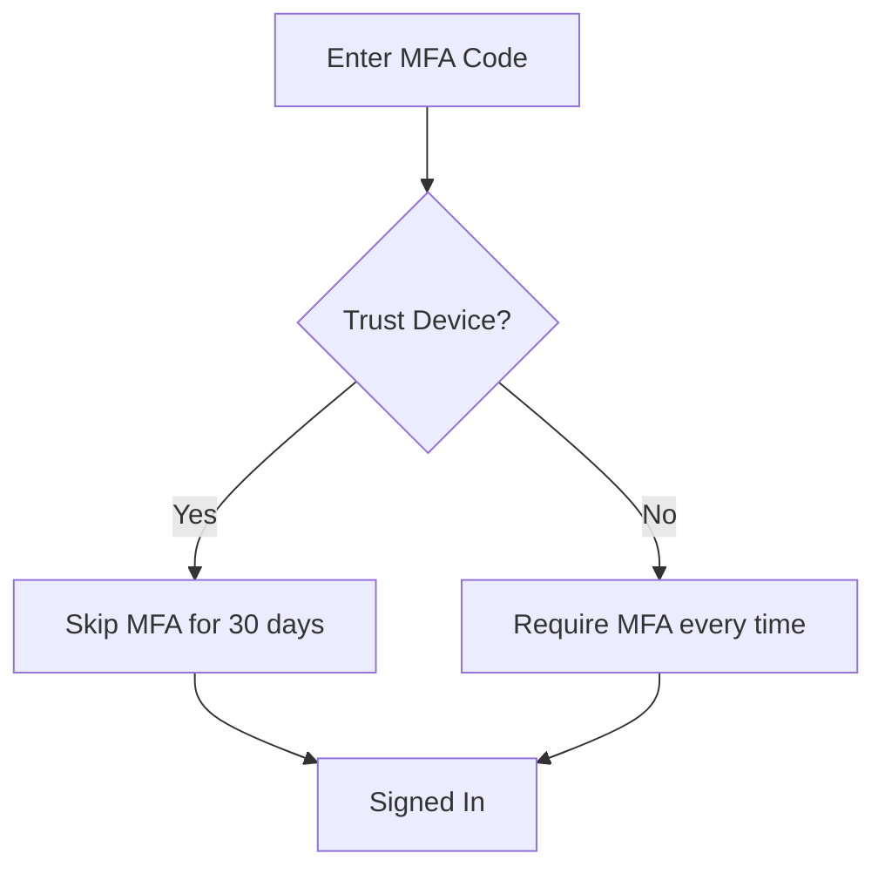

# Multi-Factor Authentication (MFA) Guide

> **Version**: 5.52.29 | **Last Updated**: January 25, 2026 | **Audience**: All Users

This guide covers setting up and using Multi-Factor Authentication (MFA) in RADIANT, including TOTP authenticator apps, backup codes, and trusted devices.

---

## Table of Contents

1. [What is MFA?](#what-is-mfa)
2. [Setting Up MFA](#setting-up-mfa)
3. [Using MFA](#using-mfa)
4. [Backup Codes](#backup-codes)
5. [Trusted Devices](#trusted-devices)
6. [Managing MFA](#managing-mfa)
7. [Troubleshooting](#troubleshooting)
8. [For Administrators](#for-administrators)

---

## What is MFA?

Multi-Factor Authentication (MFA) adds an extra layer of security to your account by requiring two things to sign in:

1. **Something you know**: Your password
2. **Something you have**: A code from your phone

Even if someone learns your password, they cannot access your account without also having your phone.

### Who Needs MFA?

| User Type | MFA Requirement |
|-----------|----------------|
| **Tenant Owners** | Always required |
| **Tenant Admins** | Always required |
| **Standard Users** | Depends on organization policy |
| **Platform Admins** | Always required (cannot disable) |

---

## Setting Up MFA

### Requirements

Before you begin, you need:

- A smartphone or tablet
- An authenticator app installed:
  - **Google Authenticator** (iOS/Android)
  - **Microsoft Authenticator** (iOS/Android)
  - **1Password** (iOS/Android/Desktop)
  - **Authy** (iOS/Android/Desktop)
  - **Any TOTP-compatible app**

### Step-by-Step Setup

1. **Sign in** to your RADIANT account
2. Navigate to **Account Settings** → **Security**
3. Click **Enable MFA** or **Set Up Two-Factor Authentication**

4. You'll see a **QR code** on screen
5. Open your **authenticator app** on your phone
6. Tap **+** or **Add Account**
7. Select **Scan QR Code**
8. Point your camera at the QR code
9. Your authenticator app will show a **6-digit code**
10. Enter the code in RADIANT
11. Click **Verify and Enable**

### Manual Entry (If QR Won't Scan)

If you cannot scan the QR code:

1. Click **Can't scan? Enter manually**
2. Copy the **secret key** shown
3. In your authenticator app, select **Enter manually** or **Enter setup key**
4. Enter:
   - **Account name**: Your email or "RADIANT"
   - **Secret key**: Paste the key you copied
   - **Time-based**: Yes (TOTP)
5. The app will start showing codes
6. Enter the current code in RADIANT

> **Important**: Never share your secret key with anyone!

---

## Using MFA

### Signing In with MFA

1. Enter your **email** and **password**
2. Click **Sign In**
3. You'll see the MFA verification screen
4. Open your **authenticator app**
5. Find your RADIANT account
6. Enter the current **6-digit code**
7. Click **Verify**

### MFA Code Tips

| Tip | Details |
|-----|---------|
| **Codes change every 30 seconds** | Wait for a new code if the current one is about to expire |
| **Codes are time-sensitive** | Your device clock must be accurate |
| **Each code works once** | You cannot reuse a code |
| **No spaces needed** | Enter `123456` not `123 456` |

---

## Backup Codes

Backup codes are emergency codes you can use if you lose access to your authenticator app.

### Getting Your Backup Codes

When you enable MFA, you receive **10 backup codes**. Each code can only be used **once**.

1. After enabling MFA, you'll see your backup codes
2. **Save them securely**:
   - Download as a file
   - Print them out
   - Store in a password manager
3. Click **I've saved my codes** to continue

### Using a Backup Code

1. On the MFA verification screen, click **Use a backup code**
2. Enter one of your backup codes
3. Click **Verify**
4. You're signed in, but that code is now used

### Regenerating Backup Codes

If you've used most of your codes or lost them:

1. Sign in to your account
2. Go to **Account Settings** → **Security**
3. Click **Regenerate Backup Codes**
4. Confirm with your current MFA code
5. Save your new codes (old codes are invalidated)

> **Warning**: Regenerating codes invalidates all previous backup codes!

---

## Trusted Devices

Skip MFA on devices you use regularly by marking them as trusted.

### Trusting a Device

1. After entering your MFA code, check **Trust this device for 30 days**
2. Click **Verify**
3. For the next 30 days, you won't need MFA on this device

### Managing Trusted Devices

1. Go to **Account Settings** → **Security** → **Trusted Devices**
2. View all your trusted devices:
   - Device name/browser
   - Last used
   - Trust expiration
3. To remove trust, click **Remove** next to a device

### Trusted Device Limits

| Setting | Default |
|---------|---------|
| **Maximum trusted devices** | 5 |
| **Trust duration** | 30 days |
| **Trust auto-expires** | Yes, after 30 days |

If you reach the maximum, trusting a new device will remove the oldest trusted device.

---

## Managing MFA

### Viewing MFA Status

1. Go to **Account Settings** → **Security**
2. The MFA section shows:
   - ✅ **Enabled** or ❌ **Disabled**
   - Date MFA was enabled
   - Number of backup codes remaining

### Changing Your Authenticator App

To switch to a different authenticator app:

1. Go to **Account Settings** → **Security**
2. Click **Change Authenticator**
3. Enter your current MFA code to verify
4. Scan the new QR code with your new app
5. Enter a code from the new app
6. Click **Verify and Update**

Your old app will stop working for RADIANT.

### Disabling MFA

> **Note**: Admins may not be able to disable MFA due to security policies.

1. Go to **Account Settings** → **Security**
2. Click **Disable MFA**
3. Enter your current MFA code
4. Confirm the action
5. MFA is now disabled

---

## Troubleshooting

### "Invalid code" Error

**Possible causes:**
- Code has expired (codes last 30 seconds)
- Device clock is incorrect
- Wrong account in authenticator app

**Solutions:**

1. **Wait for a new code**: If the code is about to change, wait for the next one
2. **Check your device time**: Ensure your phone's time is set to automatic
   - **iOS**: Settings → General → Date & Time → Set Automatically
   - **Android**: Settings → System → Date & Time → Automatic
3. **Verify the account**: Make sure you're using the RADIANT entry, not a different service

### Lost Access to Authenticator App

**If you have backup codes:**
1. Click **Use a backup code** on the MFA screen
2. Enter one of your saved codes
3. Once signed in, set up a new authenticator app

**If you don't have backup codes:**
1. Click **Can't access your code?** on the MFA screen
2. Follow the account recovery process:
   - Verify your email
   - Answer security questions (if set up)
   - Wait for admin approval (if required)
3. Contact your organization's admin if self-recovery fails

### New Phone

Got a new phone? Here's how to transfer your MFA:

**Option 1: Before wiping old phone**
1. Sign in on a computer
2. Change your authenticator (see "Changing Your Authenticator App")
3. Set up the new app on your new phone

**Option 2: After wiping old phone**
1. Use a backup code to sign in
2. Set up MFA with your new phone
3. Save your new backup codes

**Option 3: Using Authy or 1Password**
These apps can sync across devices, so your codes transfer automatically.

### Clock Sync Issues

TOTP codes depend on accurate time. If codes consistently fail:

1. Enable automatic time on your device
2. If already enabled, toggle it off and on
3. Restart your authenticator app
4. Try again

---

## For Administrators

### MFA Enforcement

See the [Tenant Admin Guide](./tenant-admin-guide.md#mfa-policies) for configuring MFA policies.

### Resetting User MFA

If a user is locked out:

1. Navigate to **Admin** → **Users**
2. Find the user
3. Click **⋮** → **Reset MFA**
4. Confirm the action
5. The user will need to set up MFA again

### MFA Reports

View MFA adoption in your organization:

1. Navigate to **Admin** → **Security** → **MFA Report**
2. See:
   - Users with MFA enabled
   - Users without MFA
   - MFA methods in use
   - Recent MFA failures

---

## Security Best Practices

| Practice | Why |
|----------|-----|
| **Use a reputable authenticator app** | Avoid apps that backup codes to insecure locations |
| **Save backup codes offline** | Don't store them in email or cloud notes |
| **Don't share codes** | Codes are for your use only |
| **Review trusted devices regularly** | Remove devices you no longer use |
| **Enable biometric lock on your authenticator** | Adds another layer of protection |

---

## Related Documentation

- [Authentication Overview](./overview.md)
- [User Guide](./user-guide.md)
- [Tenant Admin Guide](./tenant-admin-guide.md)
- [Troubleshooting](./troubleshooting.md)
