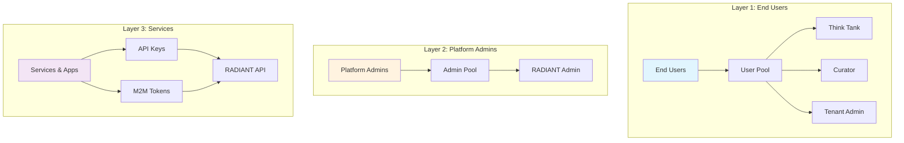
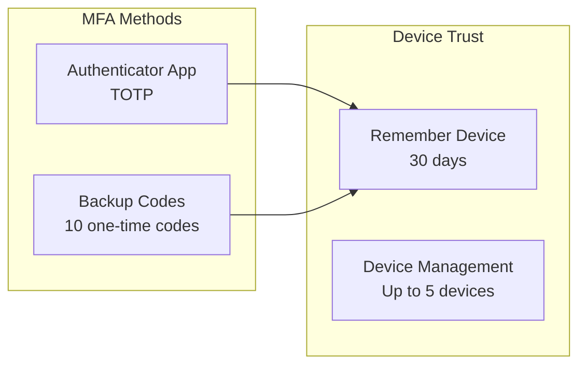
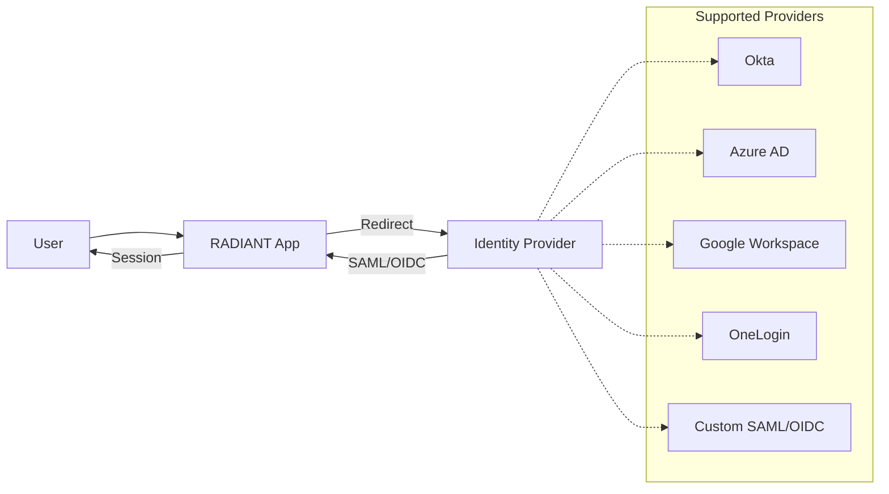
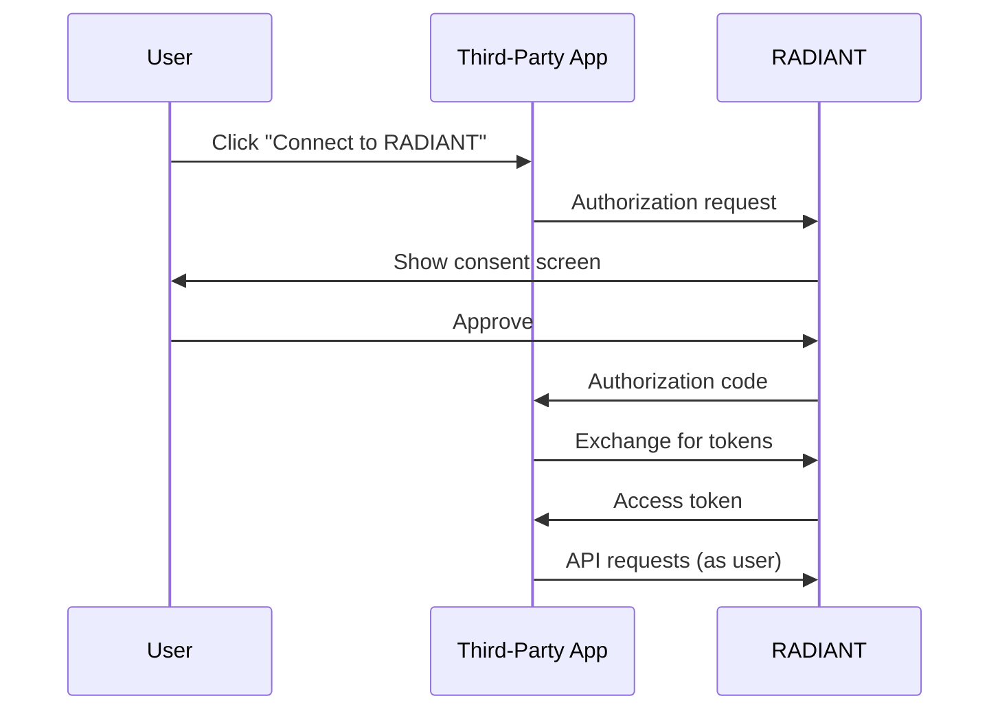

# RADIANT Authentication Overview

> **Version**: 5.52.29 | **Last Updated**: January 25, 2026 | **PROMPT-41C**

RADIANT provides enterprise-grade authentication with multi-layer security, supporting everything from individual users to large organizations with complex security requirements.

## Key Features

| Feature | Description |
|---------|-------------|
| **Multi-layer authentication** | End users, tenant admins, and platform admins |
| **Enterprise SSO** | SAML 2.0 and OIDC integration |
| **Two-Factor Authentication** | Required for admin roles |
| **OAuth 2.0 Provider** | Third-party app integrations |
| **18 Language Support** | Full internationalization including RTL |
| **Multi-language Search** | CJK (Chinese, Japanese, Korean) support |

## Authentication Layers

RADIANT implements three distinct authentication layers, each designed for specific use cases:

### Layer 1: End-User Authentication

For users of Think Tank, Curator, and Tenant Admin applications.

| Feature | Description |
|---------|-------------|
| **Sign-in Methods** | Email/password, Google, Microsoft, Apple, GitHub |
| **Enterprise SSO** | SAML 2.0 and OIDC for organization-wide sign-in |
| **Passkeys** | WebAuthn/FIDO2 passwordless authentication |
| **MFA** | Optional for standard users, required for tenant admins |
| **Languages** | 18 languages including Arabic (RTL) |

### Layer 2: Platform Administrator Authentication

For RADIANT platform operators and support staff.

| Feature | Description |
|---------|-------------|
| **Access** | Invitation-only (no self-registration) |
| **MFA** | Always required, cannot be disabled |
| **Session Timeout** | 30 minutes (shorter than end users) |
| **Audit** | All actions logged with full context |

### Layer 3: Service Authentication

For programmatic access and third-party integrations.

| Feature | Description |
|---------|-------------|
| **API Keys** | Long-lived keys for server-to-server communication |
| **OAuth Tokens** | Short-lived tokens for third-party apps acting as users |
| **Scopes** | Fine-grained permissions for each token/key |

---

## Supported Languages

RADIANT authentication screens are available in 18 languages:

| Language | Code | Direction | Search Method |
|----------|------|-----------|---------------|
| English | `en` | LTR | PostgreSQL FTS |
| Spanish | `es` | LTR | PostgreSQL FTS |
| French | `fr` | LTR | PostgreSQL FTS |
| German | `de` | LTR | PostgreSQL FTS |
| Portuguese | `pt` | LTR | PostgreSQL FTS |
| Italian | `it` | LTR | PostgreSQL FTS |
| Dutch | `nl` | LTR | PostgreSQL FTS |
| Polish | `pl` | LTR | PostgreSQL `simple` |
| Russian | `ru` | LTR | PostgreSQL FTS |
| Turkish | `tr` | LTR | PostgreSQL FTS |
| Japanese | `ja` | LTR | `pg_bigm` bi-gram |
| Korean | `ko` | LTR | `pg_bigm` bi-gram |
| Chinese (Simplified) | `zh-CN` | LTR | `pg_bigm` bi-gram |
| Chinese (Traditional) | `zh-TW` | LTR | `pg_bigm` bi-gram |
| **Arabic** | `ar` | **RTL** | PostgreSQL `simple` |
| Hindi | `hi` | LTR | PostgreSQL `simple` |
| Thai | `th` | LTR | PostgreSQL `simple` |
| Vietnamese | `vi` | LTR | PostgreSQL `simple` |

See [Internationalization Guide](./i18n-guide.md) for details on changing your language.

---

## Security Features

### Multi-Factor Authentication (MFA)

| Method | Description |
|--------|-------------|
| **TOTP** | Time-based codes from authenticator apps (Google, Microsoft, 1Password, Authy) |
| **Backup Codes** | 10 one-time recovery codes for emergency access |
| **Device Trust** | Skip MFA verification on trusted devices for 30 days |

### Enterprise SSO

### OAuth for Third-Party Apps

Third-party applications can request permission to access RADIANT on behalf of users:

---

## Application Matrix

| Application | User Types | MFA | SSO | OAuth | Languages |
|-------------|-----------|-----|-----|-------|-----------|
| **Think Tank** | Standard users | Optional (hidden) | ✅ | N/A | 18 |
| **Curator** | Standard users | Optional (hidden) | ✅ | N/A | 18 |
| **Tenant Admin** | Tenant admins/owners | Required | ✅ | N/A | 18 |
| **RADIANT Admin** | Platform admins | Required | ❌ | N/A | 18 |

---

## Quick Links

| Document | Audience | Description |
|----------|----------|-------------|
| [User Authentication Guide](./user-guide.md) | End Users | Sign-in, password, passkeys |
| [Tenant Admin Guide](./tenant-admin-guide.md) | Tenant Admins | SSO, user management, MFA policies |
| [Platform Admin Guide](./platform-admin-guide.md) | Platform Admins | System-wide auth configuration |
| [MFA Setup Guide](./mfa-guide.md) | All Admins | Two-factor authentication setup |
| [OAuth Developer Guide](./oauth-guide.md) | Developers | Building third-party integrations |
| [Internationalization Guide](./i18n-guide.md) | All | Language settings, RTL support |
| [API Reference](../api/authentication-api.md) | Developers | Technical API documentation |
| [Search API Reference](../api/search-api.md) | Developers | Multi-language search |
| [Security Architecture](../security/authentication-architecture.md) | Security Teams | Compliance and architecture |
| [Troubleshooting](./troubleshooting.md) | All | Common issues and solutions |

---

## Related Documentation

- [RADIANT Admin Guide](../RADIANT-ADMIN-GUIDE.md) - Platform administration
- [Think Tank Admin Guide](../THINKTANK-ADMIN-GUIDE.md) - Tenant administration
- [Think Tank User Guide](../THINKTANK-USER-GUIDE.md) - End-user documentation
- [Engineering Implementation Vision](../ENGINEERING-IMPLEMENTATION-VISION.md) - Technical architecture
