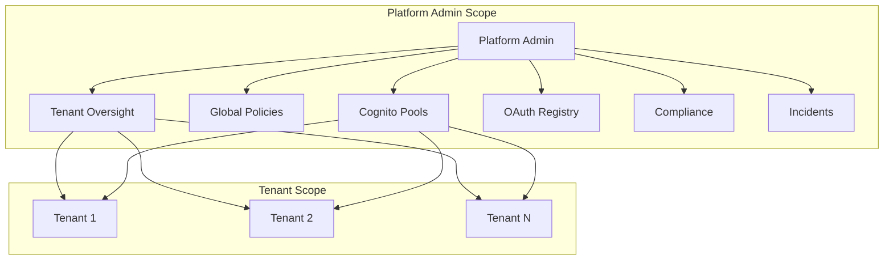
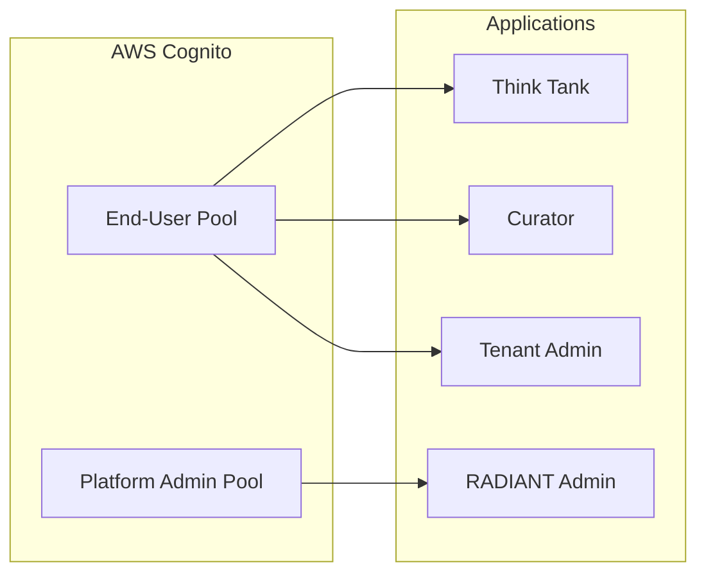
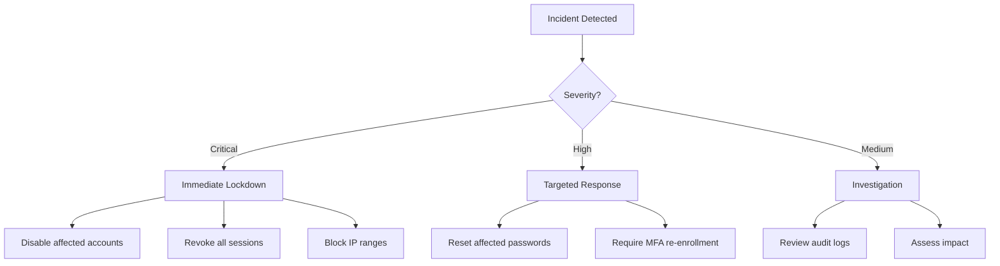

# Platform Administrator Authentication Guide

> **Version**: 5.52.29 | **Last Updated**: January 25, 2026 | **Audience**: Platform Administrators

This guide covers system-wide authentication configuration for RADIANT platform administrators: managing Cognito pools, global security policies, tenant authentication settings, and compliance configuration.

---

## Table of Contents

1. [Overview](#overview)
2. [Cognito User Pool Management](#cognito-user-pool-management)
3. [Global Security Policies](#global-security-policies)
4. [Tenant Authentication Management](#tenant-authentication-management)
5. [OAuth Provider Management](#oauth-provider-management)
6. [Compliance & Audit](#compliance--audit)
7. [Emergency Procedures](#emergency-procedures)
8. [Infrastructure Configuration](#infrastructure-configuration)

---

## Overview

As a Platform Administrator, you manage authentication infrastructure across all tenants. Your responsibilities include:

| Responsibility | Scope |
|---------------|-------|
| **Cognito Pool Management** | Configure AWS Cognito settings |
| **Global Security Policies** | Set platform-wide security baselines |
| **Tenant Oversight** | Monitor and assist tenant authentication |
| **OAuth Provider Registry** | Manage platform-level OAuth settings |
| **Compliance Configuration** | Configure audit, retention, and compliance features |
| **Incident Response** | Handle security incidents and emergency access |

> **Note**: Platform administrators always require MFA and have shorter session timeouts (30 minutes) compared to tenant users.

---

## Cognito User Pool Management

### User Pool Architecture

RADIANT uses separate Cognito User Pools for different user types:

| Pool | Purpose | Users |
|------|---------|-------|
| **End-User Pool** | Think Tank, Curator, Tenant Admin users | Organization members |
| **Platform Admin Pool** | RADIANT platform administrators | Internal operations |

### Configuring the End-User Pool

1. Navigate to **Platform Admin** → **Infrastructure** → **Cognito**
2. Select **End-User Pool**
3. Configure settings:

| Setting | Description | Recommended |
|---------|-------------|-------------|
| **Password policy** | Minimum requirements | 12+ chars, mixed case, number, symbol |
| **MFA configuration** | Available MFA methods | TOTP enabled |
| **Account recovery** | How users reset passwords | Email verification |
| **Email configuration** | SES for transactional emails | Use verified SES domain |
| **Lambda triggers** | Custom authentication logic | Pre-signup, Post-confirm |

### Configuring the Platform Admin Pool

1. Navigate to **Platform Admin** → **Infrastructure** → **Cognito**
2. Select **Platform Admin Pool**
3. This pool has stricter defaults:

| Setting | Value | Changeable |
|---------|-------|------------|
| **Self-registration** | Disabled | No |
| **MFA** | Required (TOTP) | No |
| **Password length** | 16+ characters | Can increase only |
| **Session duration** | 30 minutes | Can decrease only |

### Managing App Clients

App clients define how applications connect to Cognito:

1. Navigate to **Cognito** → **App Clients**
2. View existing clients:

| Client | Application | OAuth Flows |
|--------|-------------|-------------|
| `thinktank-web` | Think Tank Web | Authorization Code + PKCE |
| `curator-web` | Curator Web | Authorization Code + PKCE |
| `admin-web` | Admin Dashboard | Authorization Code + PKCE |
| `api-m2m` | Machine-to-Machine | Client Credentials |

3. To create a new client, click **Add Client** and configure:
   - **Name**: Descriptive identifier
   - **Generate secret**: Yes for server apps, No for SPAs
   - **OAuth flows**: Select appropriate flows
   - **Scopes**: Limit to required scopes

---

## Global Security Policies

### Password Policy Baseline

Set minimum password requirements that all tenants must meet:

1. Navigate to **Platform Admin** → **Security** → **Global Policies**
2. Under **Password Baseline**:

| Setting | Minimum | Maximum | Default |
|---------|---------|---------|---------|
| **Length** | 8 | — | 12 |
| **Uppercase** | Required | — | Required |
| **Lowercase** | Required | — | Required |
| **Numbers** | Required | — | Required |
| **Symbols** | Optional | — | Required |
| **History** | 0 | 24 | 5 |

Tenants can only set policies **stricter** than the baseline.

### MFA Policy Baseline

Define minimum MFA requirements:

| User Type | Platform Minimum | Tenant Can Override |
|-----------|-----------------|---------------------|
| **Tenant Owners** | Required | No (cannot weaken) |
| **Tenant Admins** | Required | No (cannot weaken) |
| **Members** | Hidden | Yes (can require) |

### Session Policy Baseline

| Setting | Platform Limit | Tenant Range |
|---------|---------------|--------------|
| **Max session length** | 30 days | 1 hour - 30 days |
| **Inactivity timeout** | 7 days | 15 min - 7 days |
| **Concurrent sessions** | 10 | 1 - 10 |

### Rate Limiting

Protect against abuse with rate limits:

| Endpoint | Limit | Window |
|----------|-------|--------|
| `/auth/signin` | 10 requests | 1 minute per IP |
| `/auth/signup` | 5 requests | 1 minute per IP |
| `/auth/password-reset` | 3 requests | 1 hour per email |
| `/auth/mfa/verify` | 5 requests | 1 minute per user |

---

## Tenant Authentication Management

### Viewing Tenant Auth Status

1. Navigate to **Platform Admin** → **Tenants**
2. The **Authentication** column shows:
   - 🟢 **Healthy**: No issues
   - 🟡 **Warning**: Potential issues (high failure rate, expiring certs)
   - 🔴 **Critical**: Active issues (SSO down, lockouts)

### Tenant SSO Oversight

View and assist with tenant SSO configurations:

1. Navigate to **Platform Admin** → **Tenants** → **[Tenant]** → **SSO**
2. View:
   - SSO provider details
   - Certificate expiration dates
   - Recent authentication success/failure rates
   - Error logs

### Certificate Expiration Alerts

Automatic alerts are sent when:

| Timeframe | Alert Level | Recipients |
|-----------|-------------|------------|
| 30 days before | Info | Tenant admins |
| 14 days before | Warning | Tenant admins, Platform admins |
| 7 days before | Critical | All admins + escalation |
| Expired | Emergency | All + service status page |

### Assisting Tenant Users

To help a tenant user with authentication issues:

1. Navigate to **Platform Admin** → **Tenants** → **[Tenant]** → **Users**
2. Find the user
3. Available actions:
   - **Reset password**: Send password reset email
   - **Reset MFA**: Clear MFA configuration
   - **Unlock account**: Remove lockout
   - **Terminate sessions**: Force re-authentication
   - **View auth logs**: See recent activity

> **Audit**: All platform admin actions on tenant users are logged with full context.

---

## OAuth Provider Management

### Platform OAuth Applications

Manage applications that can integrate with RADIANT across tenants:

1. Navigate to **Platform Admin** → **OAuth** → **Applications**
2. View registered applications:

| Field | Description |
|-------|-------------|
| **Name** | Application display name |
| **Publisher** | Verified publisher (if any) |
| **Client ID** | Public identifier |
| **Redirect URIs** | Allowed callback URLs |
| **Scopes** | Maximum permitted scopes |
| **Status** | Active, Suspended, Pending Review |

### Registering a Platform App

For first-party or verified partner applications:

1. Click **Register Application**
2. Enter application details:
   - **Name**: Display name shown to users
   - **Description**: What the app does
   - **Publisher**: Company/developer name
   - **Logo URL**: 256x256 PNG/SVG
   - **Privacy Policy URL**: Required
   - **Terms of Service URL**: Required
3. Configure OAuth settings:
   - **Redirect URIs**: Exact match required
   - **Allowed scopes**: Select from available scopes
   - **Token lifetime**: Access token expiration
4. Click **Register**
5. Securely store the **Client Secret** (shown only once)

### Scope Definitions

| Scope | Access | Sensitivity |
|-------|--------|-------------|
| `openid` | Basic identity | Low |
| `profile` | Name, avatar | Low |
| `email` | Email address | Medium |
| `read:sessions` | View user sessions | Medium |
| `write:sessions` | Modify sessions | High |
| `read:files` | Access user files | High |
| `write:files` | Upload/delete files | High |
| `admin:tenant` | Tenant admin actions | Critical |

### Suspending an Application

If an application is compromised or violates policies:

1. Find the application in the list
2. Click **Suspend**
3. Select reason:
   - **Security incident**
   - **Policy violation**
   - **Publisher request**
4. All tokens are immediately invalidated
5. Tenants are notified

---

## Compliance & Audit

### Audit Log Configuration

Configure what authentication events are logged:

1. Navigate to **Platform Admin** → **Compliance** → **Audit Configuration**
2. Enable/disable event categories:

| Category | Events | Default |
|----------|--------|---------|
| **Authentication** | Sign-in, sign-out, failures | Enabled |
| **MFA** | Setup, verification, reset | Enabled |
| **Password** | Change, reset, policy violations | Enabled |
| **Session** | Create, terminate, timeout | Enabled |
| **Admin Actions** | All admin operations | Enabled (cannot disable) |
| **OAuth** | Authorization, token issuance | Enabled |

### Log Retention

Configure retention periods (compliance requirements may mandate minimums):

| Log Type | Default | Minimum | Maximum |
|----------|---------|---------|---------|
| **Authentication** | 90 days | 30 days | 7 years |
| **Admin Actions** | 7 years | 1 year | 7 years |
| **Security Incidents** | 7 years | 7 years | 7 years |

### Compliance Reports

Generate pre-built compliance reports:

1. Navigate to **Platform Admin** → **Compliance** → **Reports**
2. Available reports:

| Report | Contents | Frequency |
|--------|----------|-----------|
| **Authentication Summary** | Sign-in stats, failure rates, MFA adoption | Weekly/Monthly |
| **Security Incidents** | Failed logins, lockouts, anomalies | Daily/Weekly |
| **SSO Health** | Provider status, cert expirations | Weekly |
| **User Access Review** | User permissions across tenants | Quarterly |
| **Admin Activity** | All platform admin actions | Monthly |

### SIEM Integration

Export logs to external SIEM systems:

1. Navigate to **Platform Admin** → **Compliance** → **Integrations**
2. Configure export:
   - **Destination**: S3 bucket, CloudWatch, or direct SIEM
   - **Format**: JSON, CEF, or LEEF
   - **Frequency**: Real-time, hourly, or daily batch
3. Test the integration
4. Enable export

---

## Emergency Procedures

### Security Incident Response

### Emergency Account Lockdown

To immediately lock down a compromised account:

1. Navigate to **Platform Admin** → **Emergency** → **Lockdown**
2. Enter the **user email** or **tenant ID**
3. Select lockdown scope:
   - **Single user**: Lock one account
   - **Tenant-wide**: Lock all users in a tenant
   - **Platform-wide**: Lock all non-admin users (extreme)
4. Confirm with your MFA code
5. Document the incident

### Emergency Access Bypass

For critical situations where normal auth is unavailable:

1. Contact the **on-call platform engineer**
2. Provide incident details and verification
3. The engineer can issue a **time-limited bypass token**
4. All bypass usage is logged and reviewed

> **Warning**: Emergency bypass is audited and should only be used for genuine emergencies.

### Credential Rotation

Rotate Cognito and OAuth secrets:

1. Navigate to **Platform Admin** → **Infrastructure** → **Secrets**
2. Select the credential to rotate
3. Click **Rotate**
4. Update any dependent systems
5. Verify functionality
6. Revoke the old credential

---

## Infrastructure Configuration

### Cognito Lambda Triggers

Custom logic hooks in the authentication flow:

| Trigger | Purpose | Example |
|---------|---------|---------|
| **Pre Sign-up** | Validate/modify registration | Block disposable emails |
| **Post Confirmation** | Actions after verification | Create default workspace |
| **Pre Authentication** | Before password verification | Check IP allowlist |
| **Post Authentication** | After successful auth | Log custom metrics |
| **Pre Token Generation** | Customize token claims | Add tenant context |

### Email Templates

Customize authentication emails:

1. Navigate to **Platform Admin** → **Infrastructure** → **Email Templates**
2. Available templates:

| Template | Trigger |
|----------|---------|
| **Verification** | New user email verification |
| **Password Reset** | Forgot password request |
| **MFA Setup** | MFA enrollment confirmation |
| **Security Alert** | Suspicious activity detected |
| **Session Alert** | New device sign-in |

3. Customize:
   - Subject line
   - Body content (HTML + plain text)
   - Sender name
4. Preview and test before saving

### Multi-Region Configuration

For global deployments:

| Setting | Description |
|---------|-------------|
| **Primary region** | Main Cognito pool location |
| **Replica regions** | Read replicas for lower latency |
| **Failover** | Automatic failover on primary outage |

---

## Related Documentation

- [Authentication Overview](./overview.md)
- [Tenant Admin Guide](./tenant-admin-guide.md)
- [Security Architecture](../security/authentication-architecture.md)
- [OAuth Developer Guide](./oauth-guide.md)
- [Compliance Documentation](../COMPLIANCE.md)
