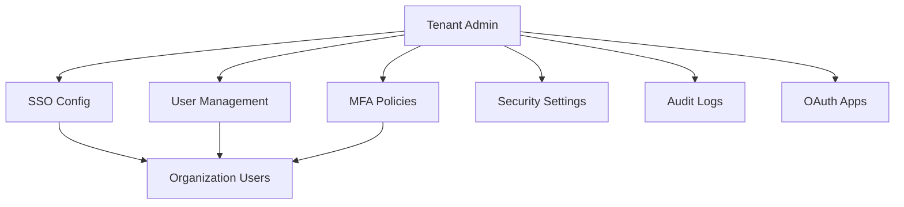
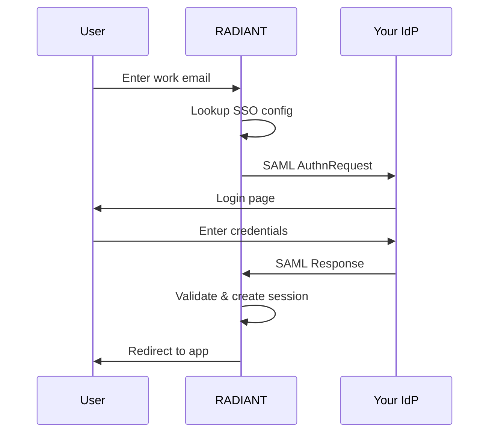

# Tenant Administrator Authentication Guide

> **Version**: 5.52.29 | **Last Updated**: January 25, 2026 | **Audience**: Tenant Administrators

This guide covers authentication management for tenant administrators: configuring SSO, managing users, enforcing MFA policies, and handling security settings for your organization.

---

## Table of Contents

1. [Overview](#overview)
2. [Single Sign-On (SSO) Configuration](#single-sign-on-sso-configuration)
3. [User Management](#user-management)
4. [MFA Policies](#mfa-policies)
5. [Session Management](#session-management)
6. [Security Settings](#security-settings)
7. [Audit Logs](#audit-logs)
8. [OAuth Applications](#oauth-applications)
9. [Language & Localization](#language--localization)

---

## Overview

As a Tenant Administrator, you manage authentication for users within your organization. You have access to:

| Capability | Description |
|------------|-------------|
| **SSO Configuration** | Set up and manage enterprise identity providers |
| **User Management** | Invite, suspend, and remove users |
| **MFA Policies** | Require or recommend MFA for user groups |
| **Session Policies** | Configure timeout and concurrent session limits |
| **Security Monitoring** | View authentication logs and failed attempts |
| **OAuth Apps** | Manage third-party application access |

---

## Single Sign-On (SSO) Configuration

### Supported Protocols

| Protocol | Use Case | Providers |
|----------|----------|-----------|
| **SAML 2.0** | Enterprise IdPs | Okta, Azure AD, OneLogin, Ping |
| **OIDC** | Modern identity providers | Auth0, Google Workspace, custom |

### Setting Up SAML 2.0

1. Navigate to **Admin** → **Authentication** → **SSO**
2. Click **Configure SAML Provider**
3. Enter your identity provider details:

| Field | Description | Example |
|-------|-------------|---------|
| **IdP Entity ID** | Unique identifier from your IdP | `https://idp.yourcompany.com/entity` |
| **SSO URL** | Where users are redirected to sign in | `https://idp.yourcompany.com/sso` |
| **Certificate** | X.509 certificate for signature verification | Paste PEM-encoded certificate |
| **Name ID Format** | User identifier format | `emailAddress` (recommended) |

4. Download the **RADIANT Service Provider metadata** to import into your IdP
5. In your IdP, configure attribute mappings:

| IdP Attribute | RADIANT Attribute | Required |
|---------------|-------------------|----------|
| `email` | `email` | Yes |
| `firstName` | `given_name` | Yes |
| `lastName` | `family_name` | Yes |
| `groups` | `groups` | Optional |
| `department` | `department` | Optional |

6. Click **Test Connection** to verify the setup
7. Enable **SSO for new users** and/or **existing users**

### Setting Up OIDC

1. Navigate to **Admin** → **Authentication** → **SSO**
2. Click **Configure OIDC Provider**
3. Enter your identity provider details:

| Field | Description | Example |
|-------|-------------|---------|
| **Issuer URL** | OIDC discovery endpoint | `https://idp.yourcompany.com` |
| **Client ID** | Application identifier | `abc123` |
| **Client Secret** | Application secret | (secure input) |
| **Scopes** | Requested permissions | `openid profile email` |

4. Configure the **redirect URI** in your IdP: `https://{your-domain}/api/auth/oidc/callback`
5. Click **Test Connection**
6. Enable for users

### SSO Options

| Option | Description | Default |
|--------|-------------|---------|
| **Auto-provision users** | Create users automatically on first SSO sign-in | Off |
| **Require SSO** | Disable password sign-in for SSO users | Off |
| **JIT group sync** | Sync group memberships from IdP | Off |
| **Allow bypass for admins** | Let tenant admins use password if SSO fails | On |

---

## User Management

### Inviting Users

1. Navigate to **Admin** → **Users**
2. Click **Invite User**
3. Enter the user's **email address**
4. Select their **role**:
   - **Member**: Standard user access
   - **Admin**: Can manage users and settings
   - **Owner**: Full tenant control
5. Optionally add to **groups**
6. Click **Send Invitation**

The user receives an email with a link to create their account.

### User Roles and Permissions

| Role | Users | Settings | Billing | SSO Config |
|------|-------|----------|---------|------------|
| **Member** | View self | View | — | — |
| **Admin** | Manage all | Manage | View | Configure |
| **Owner** | Manage all | Manage | Manage | Configure |

### Suspending Users

1. Navigate to **Admin** → **Users**
2. Find the user and click **⋮** → **Suspend**
3. Confirm the suspension

Suspended users:
- Cannot sign in
- Lose access to all applications
- Keep their data (can be restored)
- Can be unsuspended later

### Removing Users

1. Navigate to **Admin** → **Users**
2. Find the user and click **⋮** → **Remove**
3. Choose data handling:
   - **Transfer data**: Move to another user
   - **Archive data**: Keep for compliance
   - **Delete data**: Permanent removal (after retention period)
4. Confirm removal

---

## MFA Policies

### Policy Options

| Policy | Description | Applies To |
|--------|-------------|------------|
| **Required** | Users must set up MFA before accessing apps | Admins (always), or all users |
| **Encouraged** | Users see a prompt but can skip (for now) | Members |
| **Hidden** | MFA option not shown to these users | Standard users (default) |

### Configuring MFA Policy

1. Navigate to **Admin** → **Security** → **MFA Policy**
2. For each user role, select the policy:

| Role | Recommended Policy |
|------|-------------------|
| **Owner** | Required (cannot change) |
| **Admin** | Required (cannot change) |
| **Member** | Encouraged or Hidden |

3. Configure **grace period** for "Required" policy (days before enforcement)
4. Click **Save Policy**

### MFA Methods Allowed

Enable or disable MFA methods for your organization:

| Method | Description | Recommendation |
|--------|-------------|----------------|
| **TOTP** | Authenticator apps (Google, Microsoft, etc.) | Enable (most secure) |
| **Backup Codes** | 10 one-time recovery codes | Enable (for recovery) |
| **Trusted Devices** | Remember this device for 30 days | Enable (convenience) |

### Viewing MFA Status

1. Navigate to **Admin** → **Users**
2. The **MFA** column shows:
   - ✅ **Enabled**: MFA is set up
   - ⚠️ **Pending**: Required but not yet set up
   - — **Not available**: Policy is "Hidden"

### Resetting User MFA

If a user loses access to their authenticator:

1. Navigate to **Admin** → **Users**
2. Find the user and click **⋮** → **Reset MFA**
3. Confirm the reset

The user will need to set up MFA again on their next sign-in.

---

## Session Management

### Session Policies

Configure how long sessions last and concurrent session behavior:

| Setting | Description | Default |
|---------|-------------|---------|
| **Session timeout** | Inactivity before auto-logout | 7 days |
| **Absolute timeout** | Maximum session length | 30 days |
| **Concurrent sessions** | Max sessions per user | 5 |
| **Session on new device** | Require re-auth on new device | Yes |

### Viewing Active Sessions

1. Navigate to **Admin** → **Security** → **Active Sessions**
2. View all active sessions with:
   - User email
   - Device/browser info
   - Location (approximate)
   - Last activity
   - Session start time

### Terminating Sessions

To force a user to sign in again:

1. Find the session in **Active Sessions**
2. Click **Terminate**
3. The user is immediately logged out

To terminate all sessions for a user:

1. Navigate to **Admin** → **Users**
2. Find the user and click **⋮** → **Terminate All Sessions**

---

## Security Settings

### Password Policy

Configure password requirements for users who don't use SSO:

| Setting | Description | Default | Range |
|---------|-------------|---------|-------|
| **Minimum length** | Characters required | 12 | 8-128 |
| **Require uppercase** | At least one uppercase letter | Yes | — |
| **Require lowercase** | At least one lowercase letter | Yes | — |
| **Require number** | At least one digit | Yes | — |
| **Require special** | At least one symbol | Yes | — |
| **Password history** | Prevent reusing recent passwords | 5 | 0-24 |
| **Maximum age** | Days before password expires | 0 (never) | 0-365 |

### Account Lockout

Protect against brute-force attacks:

| Setting | Description | Default |
|---------|-------------|---------|
| **Lockout threshold** | Failed attempts before lockout | 5 |
| **Lockout duration** | Minutes until auto-unlock | 15 |
| **Reset counter after** | Minutes of no failed attempts | 10 |

### IP Restrictions

Limit access to specific IP ranges:

1. Navigate to **Admin** → **Security** → **IP Restrictions**
2. Click **Add Rule**
3. Enter an **IP address** or **CIDR range**
4. Select **Allow** or **Block**
5. Click **Save**

Example rules:
- `10.0.0.0/8` — Allow corporate network
- `192.168.1.100` — Allow specific IP
- `0.0.0.0/0` with Block — Block all (except allowed)

---

## Audit Logs

### Viewing Authentication Logs

1. Navigate to **Admin** → **Security** → **Audit Logs**
2. Filter by:
   - **Event type**: Sign-in, Sign-out, MFA, Password change, etc.
   - **User**: Specific user email
   - **Date range**: Custom time period
   - **Status**: Success, Failure

### Log Events Captured

| Event | Description | Details Logged |
|-------|-------------|----------------|
| `auth.signin.success` | Successful sign-in | User, device, location, method |
| `auth.signin.failed` | Failed sign-in attempt | User (if known), reason, IP |
| `auth.signout` | User signed out | User, session duration |
| `auth.mfa.setup` | MFA configured | User, method |
| `auth.mfa.verified` | MFA code accepted | User, method |
| `auth.mfa.failed` | MFA code rejected | User, attempt count |
| `auth.password.changed` | Password updated | User |
| `auth.password.reset` | Password reset via email | User, IP |
| `auth.session.terminated` | Session forcibly ended | User, by admin |

### Exporting Logs

1. Apply desired filters
2. Click **Export**
3. Select format: **CSV** or **JSON**
4. Download the file

Logs are retained for **90 days** by default (configurable per compliance requirements).

---

## OAuth Applications

Manage third-party applications that can access your organization's data.

### Viewing Connected Apps

1. Navigate to **Admin** → **Security** → **OAuth Applications**
2. View all authorized applications with:
   - Application name
   - Publisher
   - Permissions granted
   - Users who authorized
   - Last used

### Revoking App Access

To remove an application's access for all users:

1. Find the application in the list
2. Click **Revoke Access**
3. Confirm the revocation

All tokens for that application are immediately invalidated.

### App Permissions (Scopes)

| Scope | Access Level |
|-------|--------------|
| `read:profile` | User's name and email |
| `read:sessions` | User's Think Tank sessions |
| `write:sessions` | Create and modify sessions |
| `read:files` | User's uploaded files |
| `write:files` | Upload and delete files |
| `admin:users` | Manage organization users |

---

## Language & Localization

### Default Language

Set the default language for new users in your organization:

1. Navigate to **Admin** → **Settings** → **Localization**
2. Select **Default Language** from the dropdown
3. Click **Save**

### Available Languages

| Language | Code | Direction |
|----------|------|-----------|
| English | `en` | LTR |
| Spanish | `es` | LTR |
| French | `fr` | LTR |
| German | `de` | LTR |
| Japanese | `ja` | LTR |
| Korean | `ko` | LTR |
| Chinese (Simplified) | `zh-CN` | LTR |
| Chinese (Traditional) | `zh-TW` | LTR |
| **Arabic** | `ar` | **RTL** |
| *(14 more)* | — | — |

### Language Override

Users can override the default language in their personal settings.

---

## Related Documentation

- [Authentication Overview](./overview.md)
- [Platform Admin Guide](./platform-admin-guide.md)
- [MFA Setup Guide](./mfa-guide.md)
- [OAuth Developer Guide](./oauth-guide.md)
- [Security Architecture](../security/authentication-architecture.md)
- [Troubleshooting](./troubleshooting.md)
