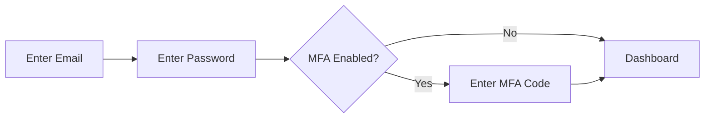
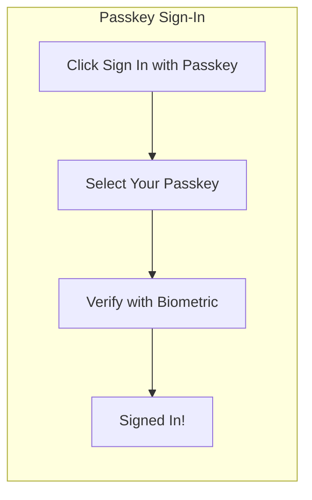
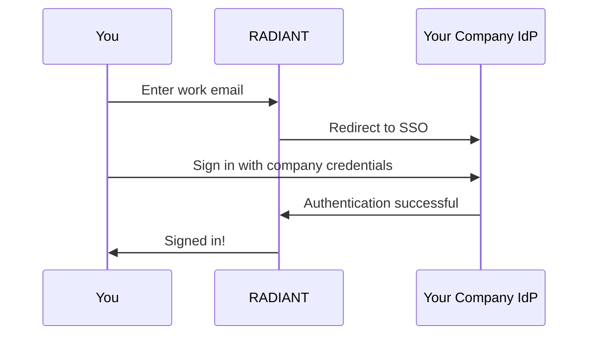

# User Authentication Guide

> **Version**: 5.52.29 | **Last Updated**: January 25, 2026 | **Audience**: End Users

This guide covers how to sign in, manage your password, set up passkeys, and change your language settings.

---

## Table of Contents

1. [Signing In](#signing-in)
2. [Password Management](#password-management)
3. [Passkeys (Passwordless)](#passkeys-passwordless)
4. [Social Sign-In](#social-sign-in)
5. [Enterprise SSO](#enterprise-sso)
6. [Language Settings](#language-settings)
7. [Common Issues](#common-issues)

---

## Signing In

### Email and Password

1. Go to your organization's Think Tank or Curator URL
2. Enter your **email address**
3. Enter your **password**
4. Click **Sign In**

### What to Expect After Signing In

| Scenario | What Happens |
|----------|--------------|
| **First sign-in** | You may be asked to verify your email |
| **New device** | Additional verification may be required |
| **MFA enabled** | Enter code from your authenticator app |
| **Session expired** | Sign in again (sessions last 7 days) |

---

## Password Management

### Password Requirements

Your password must meet these requirements:

| Requirement | Minimum |
|-------------|---------|
| **Length** | 12 characters |
| **Uppercase** | 1 letter |
| **Lowercase** | 1 letter |
| **Number** | 1 digit |
| **Special character** | 1 symbol (!@#$%^&*) |

### Changing Your Password

1. Click your **avatar** (top-right corner)
2. Select **Account Settings**
3. Click **Security** tab
4. Click **Change Password**
5. Enter your **current password**
6. Enter and confirm your **new password**
7. Click **Update Password**

### Forgot Password

1. On the sign-in page, click **Forgot password?**
2. Enter your **email address**
3. Click **Send Reset Link**
4. Check your email for the reset link
5. Click the link and enter your **new password**

> **Note**: Reset links expire after 24 hours. If expired, request a new one.

---

## Passkeys (Passwordless)

Passkeys let you sign in without a password using biometrics or your device's security.

### What is a Passkey?

A passkey is a secure credential stored on your device that uses:
- **Fingerprint** (Touch ID, fingerprint sensor)
- **Face recognition** (Face ID)
- **Device PIN/pattern** (Windows Hello, Android PIN)

### Setting Up a Passkey

1. Sign in with your email and password
2. Go to **Account Settings** → **Security**
3. Click **Add Passkey**
4. Follow your browser/device prompts to create the passkey
5. Give your passkey a **name** (e.g., "MacBook Touch ID")

### Using Your Passkey

1. On the sign-in page, click **Sign in with Passkey**
2. Select your passkey from the browser prompt
3. Verify with your biometric (fingerprint/face)
4. You're signed in!

### Managing Passkeys

- **View passkeys**: Account Settings → Security → Passkeys
- **Remove a passkey**: Click the ✕ next to the passkey name
- **Maximum passkeys**: You can have up to 10 passkeys

### Passkey Compatibility

| Platform | Browser | Biometric Support |
|----------|---------|------------------|
| macOS | Safari, Chrome, Firefox | Touch ID |
| iOS | Safari | Face ID, Touch ID |
| Windows | Chrome, Edge | Windows Hello |
| Android | Chrome | Fingerprint, Face Unlock |

---

## Social Sign-In

You can sign in using your existing accounts from:

| Provider | Click This Button |
|----------|-------------------|
| **Google** | "Continue with Google" |
| **Microsoft** | "Continue with Microsoft" |
| **Apple** | "Continue with Apple" |
| **GitHub** | "Continue with GitHub" |

### Linking Social Accounts

To link a social account to your existing RADIANT account:

1. Sign in with your email/password
2. Go to **Account Settings** → **Connected Accounts**
3. Click **Connect** next to the provider
4. Authorize the connection

### Unlinking Social Accounts

1. Go to **Account Settings** → **Connected Accounts**
2. Click **Disconnect** next to the provider
3. Confirm the disconnection

> **Warning**: If you unlink all sign-in methods, ensure you have a password set!

---

## Enterprise SSO

If your organization uses Single Sign-On (SSO), you may sign in differently.

### Signing In with SSO

1. Go to your organization's sign-in page
2. Enter your **work email address**
3. Click **Continue** — you'll be redirected to your company's identity provider
4. Sign in using your company credentials
5. You'll be automatically signed in to RADIANT

### SSO Providers Supported

- **Okta**
- **Azure Active Directory** (Microsoft Entra ID)
- **Google Workspace**
- **OneLogin**
- **Ping Identity**
- **Custom SAML 2.0 / OIDC providers**

> **Note**: SSO configuration is managed by your organization's IT administrator.

---

## Language Settings

RADIANT supports 18 languages for all authentication screens and the application interface.

### Changing Your Language

1. Click your **avatar** (top-right corner)
2. Select **Settings** (or **Account Settings**)
3. Click **Language & Region**
4. Select your preferred **language** from the dropdown
5. Click **Save**

The interface will immediately update to your selected language.

### Supported Languages

| Language | Native Name | Direction |
|----------|-------------|-----------|
| English | English | Left-to-right |
| Spanish | Español | Left-to-right |
| French | Français | Left-to-right |
| German | Deutsch | Left-to-right |
| Portuguese | Português | Left-to-right |
| Italian | Italiano | Left-to-right |
| Dutch | Nederlands | Left-to-right |
| Polish | Polski | Left-to-right |
| Russian | Русский | Left-to-right |
| Turkish | Türkçe | Left-to-right |
| Japanese | 日本語 | Left-to-right |
| Korean | 한국어 | Left-to-right |
| Chinese (Simplified) | 简体中文 | Left-to-right |
| Chinese (Traditional) | 繁體中文 | Left-to-right |
| **Arabic** | العربية | **Right-to-left** |
| Hindi | हिन्दी | Left-to-right |
| Thai | ไทย | Left-to-right |
| Vietnamese | Tiếng Việt | Left-to-right |

### Right-to-Left (RTL) Support

When using Arabic, the entire interface automatically adjusts:
- Text flows right-to-left
- Navigation moves to the right side
- Icons and buttons are mirrored appropriately
- **Email addresses**, **codes**, and **passwords** remain left-to-right for clarity

---

## Common Issues

### "Invalid email or password"

**Possible causes:**
- Incorrect password (passwords are case-sensitive)
- Using the wrong email address
- Account not yet verified

**Solutions:**
1. Check your email address for typos
2. Use **Forgot password?** to reset your password
3. Check your email for a verification link

### "Account locked"

Your account may be locked after too many failed sign-in attempts.

**Solutions:**
1. Wait 15 minutes, then try again
2. Reset your password using **Forgot password?**
3. Contact your organization's administrator

### "MFA code invalid"

**Possible causes:**
- Code has expired (codes are valid for 30 seconds)
- Clock on your device is incorrect
- Using a code from the wrong account

**Solutions:**
1. Wait for a new code to generate
2. Ensure your device's time is synced automatically
3. Verify you're scanning the correct QR code in your authenticator app

### "Session expired"

**Cause:** You haven't used the application for a while.

**Solution:** Sign in again. Your work is saved.

### "Passkey not recognized"

**Possible causes:**
- Passkey was created on a different device
- Passkey has been deleted

**Solutions:**
1. Try signing in with email/password
2. Set up a new passkey on this device

---

## Getting Help

If you continue to have issues signing in:

1. **Check the status page** for any ongoing incidents
2. **Contact your IT administrator** if you're using enterprise SSO
3. **Use the Help chat** in the bottom-right corner of the sign-in page
4. **Email support** at the address provided by your organization

---

## Related Documentation

- [Authentication Overview](./overview.md)
- [MFA Setup Guide](./mfa-guide.md)
- [Internationalization Guide](./i18n-guide.md)
- [Troubleshooting](./troubleshooting.md)
