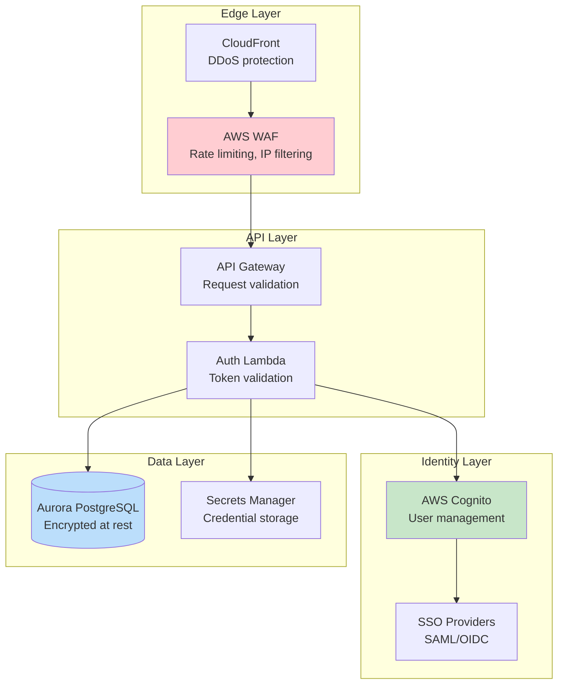
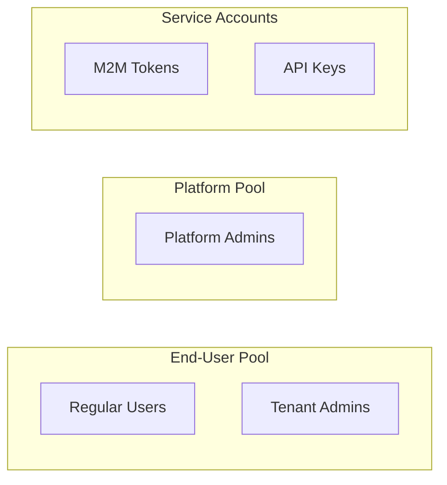
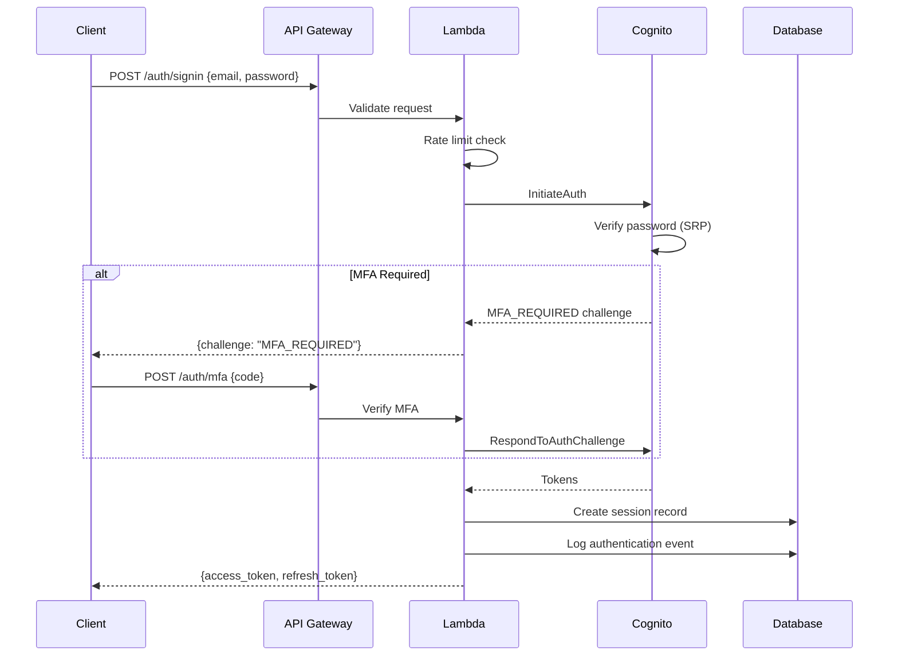
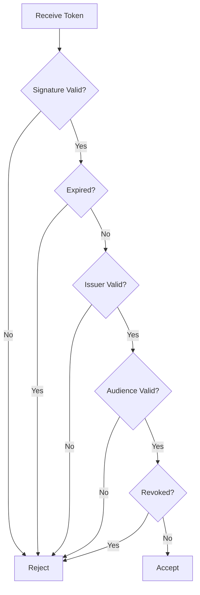
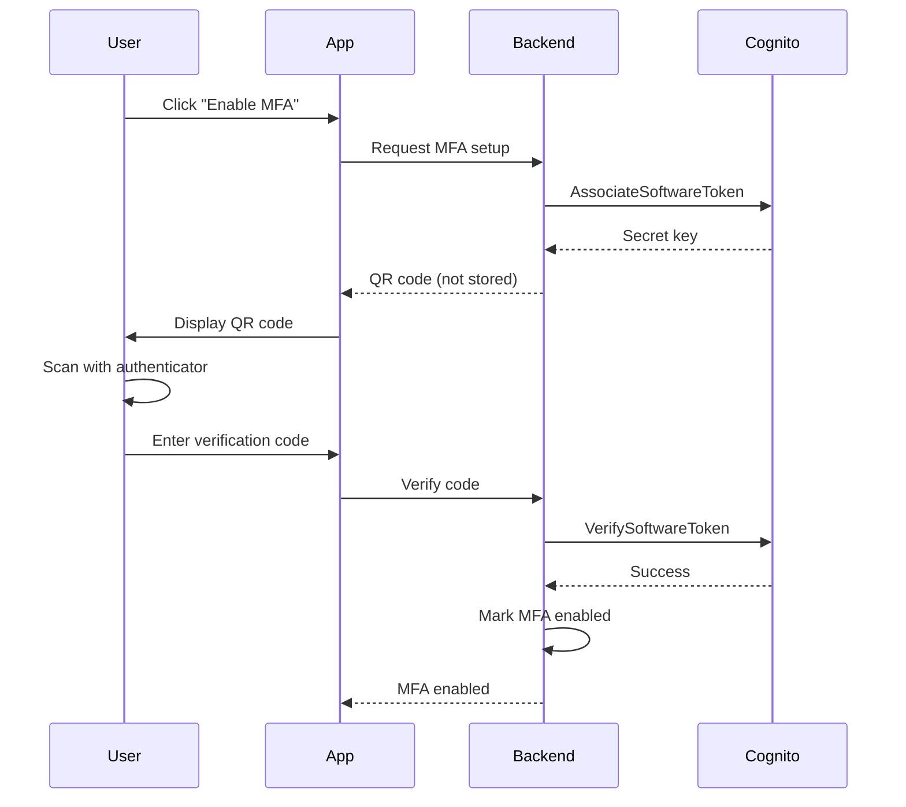
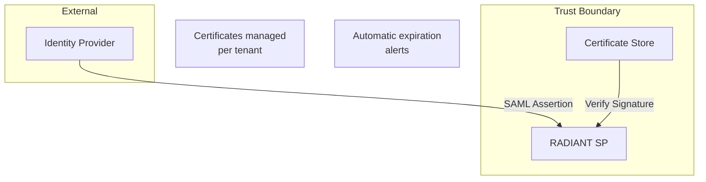
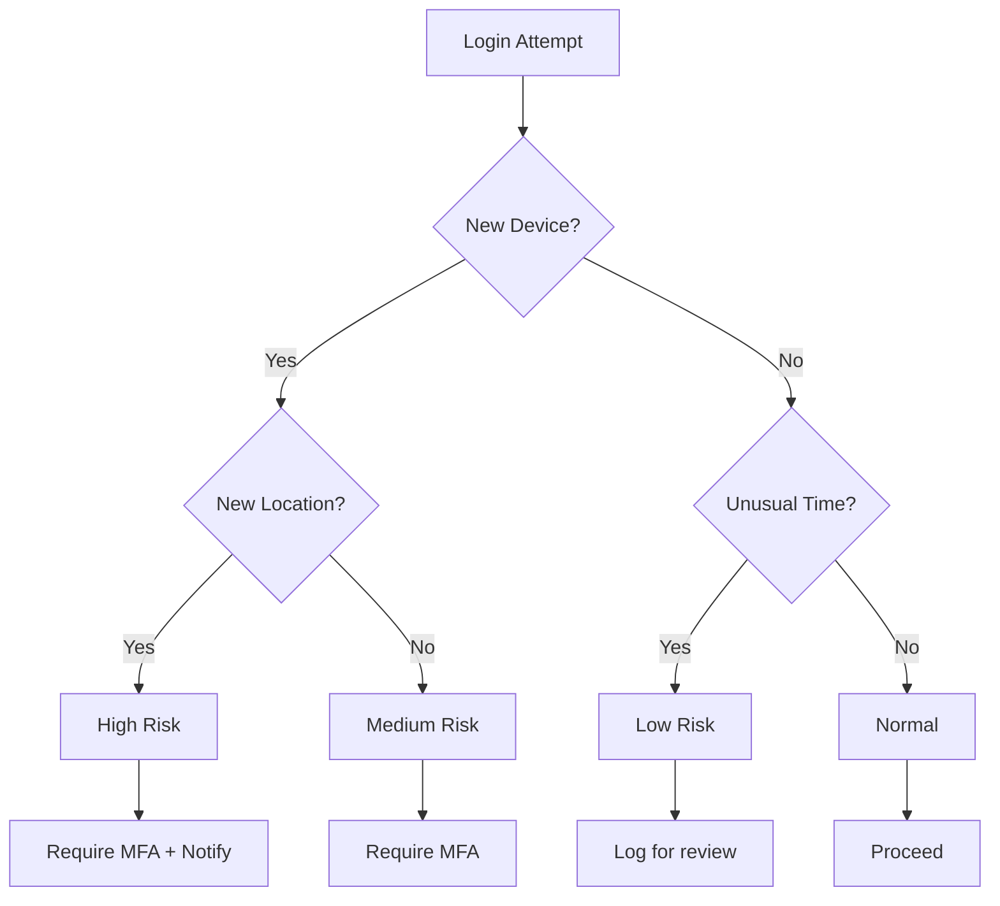

# Authentication Security Architecture

> **Version**: 5.52.29 | **Last Updated**: January 25, 2026 | **Audience**: Security Teams, Architects, Compliance Officers

This document describes RADIANT's authentication security architecture, including threat models, security controls, compliance considerations, and implementation details.

---

## Table of Contents

1. [Architecture Overview](#architecture-overview)
2. [Identity Management](#identity-management)
3. [Authentication Flows](#authentication-flows)
4. [Token Security](#token-security)
5. [Multi-Factor Authentication](#multi-factor-authentication)
6. [Session Management](#session-management)
7. [Enterprise SSO Security](#enterprise-sso-security)
8. [OAuth 2.0 Security](#oauth-20-security)
9. [Threat Mitigation](#threat-mitigation)
10. [Audit and Compliance](#audit-and-compliance)
11. [Cryptographic Standards](#cryptographic-standards)

---

## Architecture Overview

RADIANT implements a defense-in-depth authentication architecture with multiple security layers:



### Security Principles

| Principle | Implementation |
|-----------|----------------|
| **Defense in Depth** | Multiple security layers, no single point of failure |
| **Least Privilege** | Minimal permissions by default, explicit grants |
| **Zero Trust** | Verify every request, assume breach |
| **Fail Secure** | Default to deny on errors |
| **Audit Everything** | Complete authentication event logging |

---

## Identity Management

### User Pool Separation

RADIANT maintains separate identity pools for security isolation:



| Pool | Purpose | Isolation |
|------|---------|-----------|
| **End-User** | Think Tank, Curator, Tenant Admin | Per-tenant RLS |
| **Platform** | RADIANT Admin | Separate Cognito pool |
| **Service** | API integrations | Token-based, no user context |

### Tenant Isolation

Row-Level Security (RLS) ensures complete tenant data isolation:

```sql
-- All queries automatically filtered by tenant
ALTER TABLE users ENABLE ROW LEVEL SECURITY;

CREATE POLICY tenant_isolation ON users
  USING (tenant_id = current_setting('app.current_tenant_id')::uuid);
```

---

## Authentication Flows

### Password Authentication Flow



### Security Controls in Flow

| Step | Control | Purpose |
|------|---------|---------|
| Request | TLS 1.3 | Encryption in transit |
| Request | Rate limiting | Brute force prevention |
| Request | CAPTCHA (optional) | Bot prevention |
| Validation | Input sanitization | Injection prevention |
| Auth | SRP protocol | Zero-knowledge password |
| MFA | TOTP verification | Second factor |
| Response | Secure cookies | XSS/CSRF protection |

---

## Token Security

### Token Types

| Token | Type | Lifetime | Storage |
|-------|------|----------|---------|
| **Access Token** | JWT | 1 hour | Memory only |
| **Refresh Token** | Opaque | 30 days | Secure storage |
| **ID Token** | JWT | 1 hour | Memory only |
| **API Key** | Opaque | Configurable | Server-side |

### JWT Structure

```json
{
  "header": {
    "alg": "RS256",
    "typ": "JWT",
    "kid": "key-id-from-jwks"
  },
  "payload": {
    "sub": "user-uuid",
    "iss": "https://cognito-idp.region.amazonaws.com/pool-id",
    "aud": "client-id",
    "exp": 1706234567,
    "iat": 1706230967,
    "auth_time": 1706230967,
    "token_use": "access",
    "scope": "openid profile",
    "tenant_id": "tenant-uuid",
    "roles": ["member"]
  },
  "signature": "..."
}
```

### Token Validation



### Token Storage Best Practices

| Client Type | Access Token | Refresh Token |
|-------------|--------------|---------------|
| **SPA** | Memory variable | httpOnly cookie or memory |
| **Mobile** | Secure enclave | Keychain/Keystore |
| **Server** | Memory | Encrypted database |

---

## Multi-Factor Authentication

### TOTP Implementation

| Parameter | Value |
|-----------|-------|
| **Algorithm** | SHA-1 (RFC 6238 compliant) |
| **Digits** | 6 |
| **Period** | 30 seconds |
| **Clock tolerance** | ±1 period |

### MFA Enrollment Security



### Backup Codes

| Property | Value |
|----------|-------|
| **Count** | 10 codes |
| **Format** | 8 alphanumeric characters |
| **Storage** | Hashed (bcrypt) |
| **Usage** | Single use, then invalidated |

---

## Session Management

### Session Properties

| Property | Value | Rationale |
|----------|-------|-----------|
| **Session ID** | UUID v4 | Unpredictable |
| **Binding** | User + Device fingerprint | Prevent session hijacking |
| **Inactivity timeout** | Configurable (default 7 days) | Balance security/UX |
| **Absolute timeout** | Configurable (default 30 days) | Force re-authentication |
| **Concurrent limit** | Configurable (default 5) | Detect sharing/theft |

### Session Storage

```sql
CREATE TABLE user_sessions (
    id UUID PRIMARY KEY,
    user_id UUID REFERENCES users(id),
    tenant_id UUID REFERENCES tenants(id),
    device_fingerprint TEXT,
    ip_address INET,
    user_agent TEXT,
    created_at TIMESTAMPTZ,
    last_activity_at TIMESTAMPTZ,
    expires_at TIMESTAMPTZ,
    revoked_at TIMESTAMPTZ,
    revocation_reason TEXT
);

-- Index for cleanup and validation
CREATE INDEX idx_sessions_expiry ON user_sessions(expires_at) WHERE revoked_at IS NULL;
CREATE INDEX idx_sessions_user ON user_sessions(user_id, tenant_id) WHERE revoked_at IS NULL;
```

### Session Termination Events

| Event | Action |
|-------|--------|
| User logout | Revoke current session |
| Password change | Revoke all sessions |
| MFA reset | Revoke all sessions |
| Admin action | Revoke specified sessions |
| Suspicious activity | Revoke all sessions |

---

## Enterprise SSO Security

### SAML 2.0 Security

| Control | Implementation |
|---------|----------------|
| **Signature validation** | RSA-SHA256 required |
| **Assertion encryption** | AES-256 supported |
| **Replay prevention** | Assertion ID tracking, 5-min validity |
| **Audience restriction** | Enforce SP entity ID |
| **Time validation** | Clock skew ≤ 5 minutes |

### OIDC Security

| Control | Implementation |
|---------|----------------|
| **PKCE** | Required for all flows |
| **State parameter** | Required, validated |
| **Nonce** | Required for implicit flows |
| **Token binding** | Client ID validation |

### IdP Trust Model



---

## OAuth 2.0 Security

### Authorization Server Security

| Control | Implementation |
|---------|----------------|
| **PKCE** | Required (S256 only) |
| **Redirect URI** | Exact match validation |
| **State parameter** | Required, cryptographic |
| **Client authentication** | Secret for confidential clients |
| **Scope limitation** | Explicit consent required |

### Token Security

| Token Type | Security Measures |
|------------|-------------------|
| **Authorization Code** | Single-use, 10-min expiry, bound to client |
| **Access Token** | JWT signed RS256, 1-hour expiry |
| **Refresh Token** | Rotation on use, revocable |

### Consent Management

```sql
CREATE TABLE oauth_consents (
    id UUID PRIMARY KEY,
    user_id UUID REFERENCES users(id),
    client_id TEXT NOT NULL,
    scopes TEXT[] NOT NULL,
    granted_at TIMESTAMPTZ DEFAULT NOW(),
    revoked_at TIMESTAMPTZ,
    UNIQUE(user_id, client_id)
);
```

---

## Threat Mitigation

### Threat Model

| Threat | Mitigation |
|--------|------------|
| **Credential stuffing** | Rate limiting, CAPTCHA, breach monitoring |
| **Brute force** | Account lockout, progressive delays |
| **Session hijacking** | Secure cookies, device binding, IP validation |
| **Token theft** | Short expiry, secure storage, rotation |
| **Phishing** | MFA, passkeys, security training |
| **Man-in-the-middle** | TLS 1.3, certificate pinning (mobile) |
| **XSS** | CSP headers, httpOnly cookies, sanitization |
| **CSRF** | SameSite cookies, CSRF tokens |

### Rate Limiting

| Endpoint | Limit | Window | Action |
|----------|-------|--------|--------|
| `/auth/signin` | 10 | 1 minute | Block IP |
| `/auth/signup` | 5 | 1 minute | Block IP |
| `/auth/password-reset` | 3 | 1 hour | Block email |
| `/auth/mfa/verify` | 5 | 1 minute | Lock account |

### Anomaly Detection



---

## Audit and Compliance

### Authentication Events Logged

| Event | Data Captured |
|-------|---------------|
| `auth.attempt` | User, IP, device, timestamp, method |
| `auth.success` | User, IP, device, session ID, MFA used |
| `auth.failure` | User (if known), IP, device, reason |
| `auth.mfa.setup` | User, method, timestamp |
| `auth.mfa.verify` | User, method, success/failure |
| `auth.logout` | User, session ID, reason |
| `auth.session.revoke` | User, session ID, admin (if applicable) |
| `auth.password.change` | User, IP, timestamp |
| `auth.password.reset` | User, IP, timestamp |

### Log Storage

| Requirement | Implementation |
|-------------|----------------|
| **Retention** | 90 days hot, 7 years archive |
| **Encryption** | AES-256 at rest |
| **Integrity** | Hash chain, tamper detection |
| **Access** | Role-based, audited |

### Compliance Frameworks

| Framework | Authentication Requirements | Status |
|-----------|----------------------------|--------|
| **SOC 2** | Access controls, MFA, logging | ✅ Compliant |
| **GDPR** | Consent, data minimization | ✅ Compliant |
| **HIPAA** | Access controls, audit trails | ✅ Ready |
| **ISO 27001** | ISMS controls | ✅ Aligned |

---

## Cryptographic Standards

### Algorithms in Use

| Purpose | Algorithm | Key Size |
|---------|-----------|----------|
| **Password hashing** | Argon2id | Memory: 64MB, Time: 3 |
| **Token signing** | RS256 (RSA-SHA256) | 2048-bit |
| **Session IDs** | CSPRNG (UUID v4) | 128-bit |
| **MFA secrets** | HMAC-SHA1 | 160-bit |
| **Backup codes** | CSPRNG | 64-bit |
| **TLS** | TLS 1.3 | ECDHE+AES-256-GCM |

### Key Management

| Key Type | Rotation | Storage |
|----------|----------|---------|
| **Cognito signing keys** | Automatic (AWS managed) | AWS KMS |
| **SSO certificates** | Annual (manual) | Secrets Manager |
| **API secrets** | On compromise | Secrets Manager |
| **Encryption keys** | Annual (automatic) | AWS KMS |

---

## Security Recommendations

### For Tenant Administrators

1. **Enable MFA for all admins** (enforced by default)
2. **Configure SSO** for enterprise identity management
3. **Review audit logs** regularly for anomalies
4. **Set appropriate session timeouts** for your security requirements
5. **Use IP restrictions** for admin access when possible

### For Platform Administrators

1. **Monitor rate limiting effectiveness**
2. **Review failed authentication patterns**
3. **Keep SSO certificates updated** (30-day alerts)
4. **Perform regular access reviews**
5. **Test incident response procedures**

### For Developers

1. **Never log sensitive data** (passwords, tokens)
2. **Validate all tokens server-side**
3. **Use secure token storage patterns**
4. **Implement proper error handling** (no information leakage)
5. **Follow OWASP guidelines**

---

## Related Documentation

- [Authentication Overview](../authentication/overview.md)
- [Platform Admin Guide](../authentication/platform-admin-guide.md)
- [OAuth Developer Guide](../authentication/oauth-guide.md)
- [API Reference](../api/authentication-api.md)
- [Compliance Documentation](../COMPLIANCE.md)
